# crossplane-argocd
[](https://github.com/jonashackt/crossplane-argocd/actions/workflows/crossplane-argocd.yml)
[](https://github.com/jonashackt/crossplane-argocd/actions/workflows/crossplane-argocd-external-secrets.yml)

)
)
)
)
)
[](https://github.com/jonashackt/crossplane-argocd/blob/master/LICENSE)
[](https://renovatebot.com)

Example project showing how to use the crossplane together with ArgoCD

> This project is based on the crossplane only repository https://github.com/jonashackt/crossplane-aws-azure, where the basics about crossplane.io are explained in detail - incl. how to provision to AWS and Azure.

__The idea is "simple": Why not treat infrastructure deployments/provisioning the same way as application deployments?!__ An ideal combination would be crossplane as control plane framework, which manages infrastructure through the Kubernetes api together with ArgoCD as [GitOps](https://www.gitops.tech/) framework to have everything in sync with our version control system.


### TLDR: Steps from 0 to 100

If you don't want to read much text, do the following steps:

```shell
# fire up kind
kind create cluster --image kindest/node:v1.32.0 --wait 5m --name crossplane-argocd

# Install ArgoCD
kubectl apply -k argocd/install
kubectl wait --for=condition=ready pod -l app.kubernetes.io/name=argocd-server --namespace argocd --timeout=300s

# Access ArgoUI
kubectl port-forward -n argocd --address='0.0.0.0' service/argocd-server 8080:80
kubectl -n argocd get secret argocd-initial-admin-secret -o jsonpath="{.data.password}" | base64 -d; echo

# Create Secret with Doppler Service Token
# be sure to have exported the env var locally, e.g. via
# export DOPPLER_SERVICE_TOKEN="dp.st.dev.dopplerservicetoken"
kubectl create secret generic doppler-token-auth-api --from-literal dopplerToken="$DOPPLER_SERVICE_TOKEN"

# Prepare Secret with ArgoCD API Token for Crossplane ArgoCD Provider (port forward can be run in subshell appending ' &' + Ctrl-C and beeing deleted after running create-argocd-api-token-secret.sh via 'fg 1%' + Ctrl-C)
kubectl port-forward -n argocd --address='0.0.0.0' service/argocd-server 8443:443
bash create-argocd-api-token-secret.sh


# Bootstrap Crossplane via ArgoCD
kubectl apply -n argocd -f argocd/crossplane-eso-bootstrap.yaml 

kubectl get crd

# Install Crossplane EKS APIs/Composition
kubectl apply -f argocd/crossplane-apis/crossplane-apis.yaml

# Create actual EKS cluster via Crossplane & register it in ArgoCD via argocd-provider
kubectl apply -f argocd/infrastructure/aws-eks.yaml
crossplane beta trace kubernetesclusters.k8s.crossplane.jonashackt.io/deploy-target-eks -o wide

# Optional: If you want, have a look onto the new cluster
kubectl get secret eks-cluster-kubeconfig -o jsonpath='{.data.kubeconfig}' | base64 --decode > ekskubeconfig
# integrate the contents of `ekskubeconfig` into your `~/.kube/config` (better w/ VSCode!) & switch over to the new kube context

# Run Application on EKS cluster using Argo
kubectl apply -f argocd/applications/microservice-api-spring-boot.yaml
```

Now you should see both clusters (kind & EKS) running and the app beeing deployed:

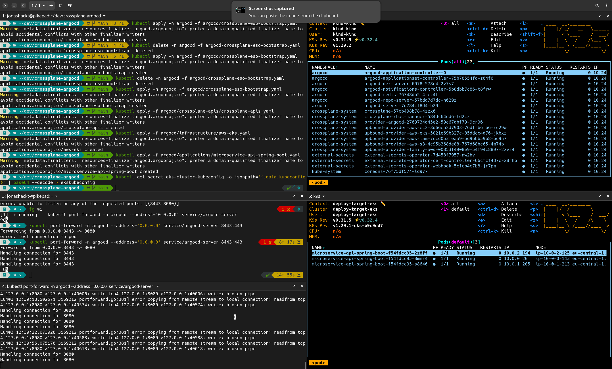


# Prerequisites: a management cluster for ArgoCD and crossplane

First we need a simple management cluster for our ArgoCD and crossplane deployments. [As in the base project](https://github.com/jonashackt/crossplane-aws-azure) we simply use kind here:

Be sure to have some packages installed. On a Mac:

```shell
brew install kind helm kubectl kustomize argocd
```

Or on Arch/Manjaro:

```shell
pamac install kind-bin helm kubectl-bin kustomize argocd
```


https://docs.crossplane.io/latest/cli/

Also we should install the crossplane CLI

```shell
curl -sL "https://raw.githubusercontent.com/crossplane/crossplane/master/install.sh" | sh
sudo mv crossplane /usr/local/bin
```

Now the `kubectl crossplane --help` command should be ready to use.


Now spin up a local kind cluster

```shell
kind create cluster --image kindest/node:v1.31.1 --wait 5m
```


# Pre-install preparations: Configure ArgoCD for Crossplane

Before even starting to install ArgoCD, we should be aware of [some needed configuration details](https://docs.crossplane.io/knowledge-base/integrations/argo-cd-crossplane/) in order to let Argo run smootly with Crossplane.

We can ignore [the mentioned health status configuration](https://docs.crossplane.io/latest/guides/crossplane-with-argo-cd/#set-health-status) in the docs, since 

> "Some checks are supported by the community directly in Argo’s repository. For example the Provider from pkg.crossplane.io has already been declared which means there no further configuration needed."

So for now we should focus on the configuration of the annotation based resource tracking in ArgoCD and the exclusion of Crossplane generated `ProviderConfigUsage` CRDs.


#### Configure annotation based resource tracking in ArgoCD

As [the docs state](https://docs.crossplane.io/knowledge-base/integrations/argo-cd-crossplane/):

> "There are different ways to configure how Argo CD tracks resources. With Crossplane, you need to configure Argo CD to use Annotation based resource tracking."

You may already used ArgoCD with resource tracking via the well-known label `app.kubernetes.io/instance`, which is the default resource tracking mode in Argo. But from ArgoCD 2.2 on [there are additional ways of tracking resources](https://argo-cd.readthedocs.io/en/stable/user-guide/resource_tracking/#additional-tracking-methods-via-an-annotation). One of them is the annotation based resource tracking. This has some advantages:

> "The advantages of using the tracking id annotation is that there are no clashes any more with other Kubernetes tools and Argo CD is never confused about the owner of a resource. The annotation+label can also be used if you want other tools to understand resources managed by Argo CD."

The resource tracking method has to be configured inside the `argocd-cm` ConfigMap using the `application.resourceTrackingMethod` field:

```yaml
apiVersion: v1
kind: ConfigMap
metadata:
  name: argocd-cm
data:
  # Set Resource Tracking Method (see https://docs.crossplane.io/knowledge-base/integrations/argo-cd-crossplane/#set-resource-tracking-method)
  application.resourceTrackingMethod: annotation
```


### Exclude Crossplane generated ProviderConfigUsage CRDs

The second necessary configuration refers to [the exclusion of Crossplane generated `ProviderConfigUsage` CRDs](https://docs.crossplane.io/knowledge-base/integrations/argo-cd-crossplane/#set-resource-exclusion):

> Crossplane providers generates a `ProviderConfigUsage` for each of the managed resource (MR) it handles. This resource enable representing the relationship between MR and a ProviderConfig so that the controller can use it as finalizer when a ProviderConfig is deleted. End-users of Crossplane are not expected to interact with this resource.

What this means is that if we have a lot of Crossplane Resources that we work with like it is shown in the following image, the ArgoCD UI reactivity can be impacted:


And because these resources don't give us anymore insights, we can savely remove them as ArgoCD resources. Therefore we also configure this in the `argocd-cm` ConfigMap:

```yaml
apiVersion: v1
kind: ConfigMap
metadata:
  name: argocd-cm
data:
  ...
  # Set Resource Exclusion (see https://docs.crossplane.io/knowledge-base/integrations/argo-cd-crossplane/#set-resource-exclusion)
  resource.exclusions: |
    - apiGroups:
      - "*"
      kinds:
      - ProviderConfigUsage      
```

We will actually configure this while installing ArgoCD in a second. Because the question is: where exactly can we change parameters of the `argocd-cm` ConfigMap in ArgoCD?


# Install ArgoCD into the management cluster

This question boils down to another question on a higher level: How do we install ArgoCD and change the ConfigMap in a flexible and GitOps-style way? Ideally also in a [renovatebot-enabled](https://github.com/renovatebot/renovate) fashion. And I already had that kind of question solved for me: Just [use Kustomize as described here](https://stackoverflow.com/a/71692892/4964553) and [also in the Argo docs](https://argo-cd.readthedocs.io/en/stable/operator-manual/declarative-setup/#manage-argo-cd-using-argo-cd).

In fact the ArgoCD team itself uses this approach to deploy their own ArgoCD instances. A live deployment [is available here](https://cd.apps.argoproj.io/) and the configuration used [can be found on GitHub](https://github.com/argoproj/argoproj-deployments/tree/master/argocd).

Using [Kustomize](https://kubernetes.io/docs/tasks/manage-kubernetes-objects/kustomization/) enables a great way of declaritively changing configuration in ConfigMaps, while using the default installation method (which [is this install.yaml](https://raw.githubusercontent.com/argoproj/argo-cd/stable/manifests/install.yaml)). And at the same time staying upgradable via Renovate. 

So let's first create a directory `argocd/install` in the root of our repository. Therein we create a file called [`kustomization.yaml`](argocd/install/kustomization.yaml) with the following contents:

```yaml
apiVersion: kustomize.config.k8s.io/v1beta1
kind: Kustomization

resources:
- github.com/argoproj/argo-cd//manifests/cluster-install?ref=v2.12.2
- argocd-namespace.yaml

## changes to config maps
patches:
- path: argocd-cm-patch.yaml

namespace: argocd
```

Under the `resources` parameter you can see a link to a ArgoCD installation manifest, followed by the ArgoCD version tag. This is a great way of enabling [Renovate](https://github.com/renovatebot/renovate) to keep our setup up-to-date automatically.

As Kustomize has the ability to use patch files, we also create a file [`argocd-cm-patch.yaml`](argocd/install/argocd-cm-patch.yaml). Here we can configure the annotation based resource tracking mode and exclude the Crossplane generated ProviderConfigUsage CRDs from ArgoCD:

```yaml
apiVersion: v1
kind: ConfigMap
metadata:
  name: argocd-cm
data:
  # Set Resource Tracking Method (see https://docs.crossplane.io/knowledge-base/integrations/argo-cd-crossplane/#set-resource-tracking-method)
  application.resourceTrackingMethod: annotation
  # Set Resource Exclusion (see https://docs.crossplane.io/knowledge-base/integrations/argo-cd-crossplane/#set-resource-exclusion)
  resource.exclusions: |
    - apiGroups:
      - "*"
      kinds:
      - ProviderConfigUsage
```

Additionally to our ConfigMap patch we create another file [argocd-namespace.yaml](argocd/install/argocd-namespace.yaml), that will automatically create the namespace `argocd` for us:

```yaml
apiVersion: v1
kind: Namespace
metadata:
  name: argocd
```

With this simple manifest and it's integration into our [`kustomization.yaml`](argocd/install/kustomization.yaml), we don't need to explicitely run `kubectl create namespace argocd` anymore.

Now we have everything prepared to install ArgoCD via Kustomize. Simply run a `kubectl apply -k` aimed to our previously created directory:

```shell
kubectl apply -k argocd/install
```


### Accessing ArgoCD GUI

Since we're using ArgoCD, we should also be able to access it's fantastic UI in our browser. Therefore we first need to obtain the initial password for the `admin` user on the command line:

```shell
kubectl -n argocd get secret argocd-initial-admin-secret -o jsonpath="{.data.password}" | base64 -d; echo
```

In order to make the `argocd-server` available outside of our management cluster we have multiple options. One of the simplest might be a `port-forward`:

```shell
kubectl port-forward -n argocd --address='0.0.0.0' service/argocd-server 8080:80
```

Now we can access the ArgoCD UI inside your Browser at http://localhost:8080 using `admin` user and the obtained password.


### Login ArgoCD CLI into our argocd-server installed in kind

https://argo-cd.readthedocs.io/en/stable/getting_started/#4-login-using-the-cli

In order to be able to add applications to Argo, we should login our ArgoCD CLI into our `argocd-server` Pod installed in kind:

```shell
argocd login localhost:8080 --username admin --password $(kubectl -n argocd get secret argocd-initial-admin-secret -o jsonpath="{.data.password}" | base64 -d; echo) --insecure
```

Remember to change the initial password in production environments!


# Let ArgoCD install Crossplane

Is it possible to already use the GitOps approach right from here on to install crossplane? Let's try it.

As already used from https://github.com/jonashackt/crossplane-aws-azure and explained in https://stackoverflow.com/a/71765472/4964553 we have a simple Helm chart, which is able to be managed by RenovateBot - and thus kept up-to-date. Our Chart lives in [`crossplane/Chart.yaml`](crossplane/Chart.yaml):

```yaml
apiVersion: v2
type: application
name: crossplane-argocd
version: 0.0.0 # unused
appVersion: 0.0.0 # unused
dependencies:
  - name: crossplane
    repository: https://charts.crossplane.io/stable
    version: 1.16.0
```

__This Helm chart needs to be picked up by Argo in a declarative GitOps way (not through the UI).__

But as this is a non-standard Helm Chart, we need to define a `Secret` first [as the docs state](https://argo-cd.readthedocs.io/en/stable/operator-manual/declarative-setup/#helm-chart-repositories):

> "Non standard Helm Chart repositories have to be registered explicitly. Each repository must have url, type and name fields."

So we first create [`crossplane-helm-secret.yaml`](argocd/crossplane-bootstrap/crossplane-helm-secret.yaml):

```yaml
apiVersion: v1
kind: Secret
metadata:
  name: crossplane-helm-repo
  namespace: argocd
  labels:
    argocd.argoproj.io/secret-type: repository
stringData:
  name: crossplane
  url: https://charts.crossplane.io/stable
  type: helm 
```

We need to apply it via:

```shell
kubectl apply -f argocd/crossplane-bootstrap/crossplane-helm-secret.yaml
```


Now telling ArgoCD where to find our simple Crossplane Helm Chart, we use Argo's `Application` manifest in [argocd/crossplane-bootstrap/crossplane.yaml](argocd/crossplane-bootstrap/crossplane.yaml):

```yaml
# The ArgoCD Application for crossplane core components themselves
---
apiVersion: argoproj.io/v1alpha1
kind: Application
metadata:
  name: crossplane
  namespace: argocd
  finalizers:
    - resources-finalizer.argocd.argoproj.io
spec:
  project: default
  source:
    repoURL: https://github.com/jonashackt/crossplane-argocd
    targetRevision: HEAD
    path: crossplane
  destination:
    server: https://kubernetes.default.svc
    namespace: crossplane-system
  syncPolicy:
    automated:
      prune: true    
    syncOptions:
    - CreateNamespace=true
    retry:
      limit: 1
      backoff:
        duration: 5s 
        factor: 2 
        maxDuration: 1m
```

As the docs state https://argo-cd.readthedocs.io/en/stable/operator-manual/declarative-setup/#crossplane-bootstrap

> "Without the `resources-finalizer.argocd.argoproj.io finalizer`, deleting an application will not delete the resources it manages. To perform a cascading delete, you must add the finalizer. See [App Deletion](https://argo-cd.readthedocs.io/en/stable/user-guide/app_deletion/#about-the-deletion-finalizer)."

In other words, if we would run `kubectl delete -n argocd -f argocd/crossplane-bootstrap/crossplane.yaml`, Crossplane wouldn't be undeployed as we may think. Only the ArgoCD `Application` would be deleted, but Crossplane Pods etc. would be still running.

Our `Application` configures Crossplane core componentes to be automatically pruned https://argo-cd.readthedocs.io/en/stable/user-guide/auto_sync/#automatic-pruning via `automated: prune: true`.

We also use `syncOptions: - CreateNamespace=true` here [to let Argo create the crossplane `crossplane-system` namespace for us automatically](https://argo-cd.readthedocs.io/en/stable/user-guide/sync-options/#create-namespace).


```shell
kubectl apply -n argocd -f argocd/crossplane-bootstrap/crossplane.yaml
```

Now ArgoCD deploys our core crossplane components for us :)

Just have a look into Argo UI:

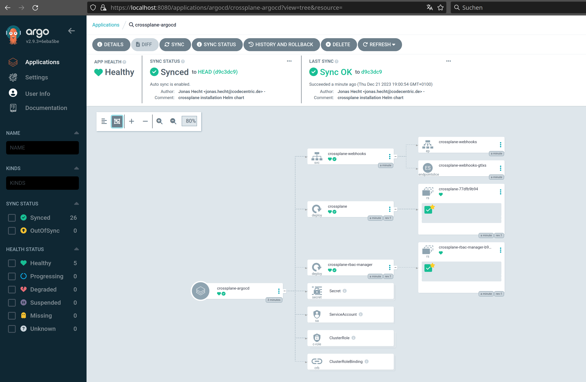

We can double check everything is there on the command line via:

```shell
kubectl get all -n crossplane-system
```
                               

### Create aws-creds.conf file & create AWS Provider secret

https://docs.crossplane.io/latest/getting-started/provider-aws/#generate-an-aws-key-pair-file

I assume here that you have [aws CLI installed and configured](https://docs.aws.amazon.com/cli/latest/userguide/getting-started-install.html). So that the command `aws configure` should work on your system. With this prepared we can create an `aws-creds.conf` file:

```shell
echo "[default]
aws_access_key_id = $(aws configure get aws_access_key_id)
aws_secret_access_key = $(aws configure get aws_secret_access_key)
" > aws-creds.conf
```

> Don't ever check this file into source control - it holds your AWS credentials! For this repository I added `*-creds.conf` to the [.gitignore](.gitignore) file. 


Now we need to use the `aws-creds.conf` file to create the Crossplane AWS Provider secret:

```shell
kubectl create secret generic aws-creds -n crossplane-system --from-file=creds=./aws-creds.conf
```


### Install crossplane's AWS provider with ArgoCD

Our crossplane AWS provider for S3 resides in [upbound/provider-aws/provider/upbound-provider-aws-s3.yaml](upbound/provider-aws/provider/upbound-provider-aws-s3.yaml):

```yaml
apiVersion: pkg.crossplane.io/v1
kind: Provider
metadata:
  name: upbound-provider-aws-s3
spec:
  package: xpkg.upbound.io/upbound/provider-aws-s3:v1.12.0
  packagePullPolicy: Always
  revisionActivationPolicy: Automatic
  revisionHistoryLimit: 1
```

How do we let ArgoCD manage and deploy this to our cluster? The simple way of [defining a directory containing k8s manifests](https://argo-cd.readthedocs.io/en/stable/user-guide/directory/) is what we're looking for. Therefore we create a new ArgoCD `Application` CRD at [argocd/crossplane-bootstrap/crossplane-provider-aws.yaml](argocd/crossplane-bootstrap/crossplane-provider-aws.yaml), which tells Argo to look in the directory path `upbound/provider-aws/config`:

```yaml
apiVersion: argoproj.io/v1alpha1
kind: Application
metadata:
  name: crossplane-provider-aws-s3
  namespace: argocd
  finalizers:
    - resources-finalizer.argocd.argoproj.io
spec:
  project: default
  source:
    path: upbound/provider-aws/config
    repoURL: https://github.com/jonashackt/crossplane-argocd
    targetRevision: HEAD
  destination:
    namespace: default
    server: https://kubernetes.default.svc
  # Using syncPolicy.automated here, otherwise the deployement of our Crossplane provider will fail with
  # 'Resource not found in cluster: pkg.crossplane.io/v1/Provider:provider-aws-s3'
  syncPolicy:
    automated: 
      prune: true     
```

The crucial point here is to use the `syncPolicy.automated` flag as described in the docs: https://argo-cd.readthedocs.io/en/stable/user-guide/auto_sync/. Otherwise the deployment of the Crossplane `upbound-provider-aws-s3` will give the following error:

```shell
Resource not found in cluster: pkg.crossplane.io/v1/Provider:upbound-provider-aws-s3
```

The automated syncPolicy makes sure that child apps are automatically created, synced, and deleted when the manifest is changed.

> This flag enables ArgoCD's "true" GitOps feature, where the CI/CD pipeline doesn't deploy themselfes (Push-based GitOps) but only makes a git commit. Then the GitOps operator inside the Kubernetes cluster (here ArgoCD) recognizes the change in the Git repository and deploys the changes to match the state of the repository in the cluster.

We also use the finalizer `resources-finalizer.argocd.argoproj.io finalizer` like we did with the Crossplane core components so that a `kubectl delete -f` would also undeploy all components of our Provider `provider-aws-s3`.

Let's apply this `Application` to our cluster also:

```shell
kubectl apply -n argocd -f argocd/crossplane-bootstrap/crossplane-provider-aws.yaml 
```


We run into the following error while syncing in Argo:

```shell
The Kubernetes API could not find aws.upbound.io/ProviderConfig for requested resource default/default. Make sure the "ProviderConfig" CRD is installed on the destination cluster.
```

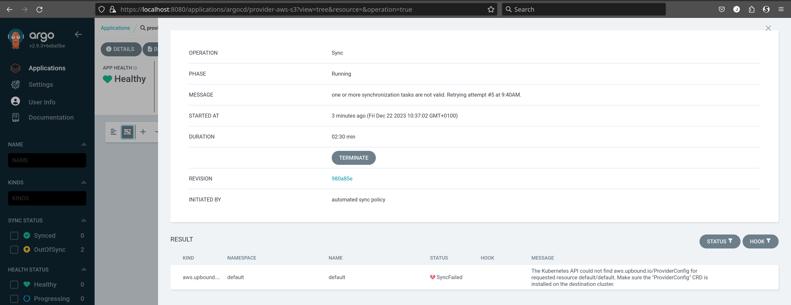


### Install crossplane's AWS provider ProviderConfig with ArgoCD

To get our Provider finally working we also need to create a `ProviderConfig` accordingly that will tell the Provider where to find it's AWS credentials. Therefore we create a [upbound/provider-aws/config/provider-aws-config.yaml](upbound/provider-aws/config/provider-aws-config.yaml):

```yaml
apiVersion: aws.upbound.io/v1beta1
kind: ProviderConfig
metadata:
  name: default
spec:
  credentials:
    source: Secret
    secretRef:
      namespace: crossplane-system
      name: aws-creds
      key: creds
```

> Crossplane resources use the `ProviderConfig` named `default` if no specific ProviderConfig is specified, so this ProviderConfig will be the default for all AWS resources.

The `secretRef.name` and `secretRef.key` has to match the fields of the already created Secret.


To let ArgoCD manage and deploy our `ProviderConfig` we again create a new ArgoCD `Application` CRD at [argocd/crossplane-bootstrap/crossplane-provider-aws-config.yaml](argocd/crossplane-bootstrap/crossplane-provider-aws-config.yaml) [defining a directory containing k8s manifests](https://argo-cd.readthedocs.io/en/stable/user-guide/directory/), which tells Argo to look in the directory path `upbound/provider-aws/config`:


```yaml
apiVersion: argoproj.io/v1alpha1
kind: Application
metadata:
  name: provider-aws-config
  namespace: argocd
  finalizers:
    - resources-finalizer.argocd.argoproj.io
spec:
  project: default
  source:
    path: upbound/provider-aws/config
    repoURL: https://github.com/jonashackt/crossplane-argocd
    targetRevision: HEAD
  destination:
    namespace: default
    server: https://kubernetes.default.svc
  # Using syncPolicy.automated here, otherwise the deployement of our Crossplane provider will fail with
  # 'Resource not found in cluster: pkg.crossplane.io/v1/Provider:provider-aws-s3'
  syncPolicy:
    automated: 
      prune: true    
```


```shell
kubectl apply -n argocd -f argocd/crossplane-bootstrap/crossplane-provider-aws-config.yaml 
```


We finally managed to let Argo deploy the Crossplane core components together with the AWS Provider and ProviderConfig correctly:

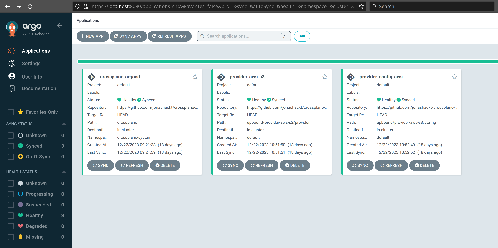


# Using ArgoCD's AppOfApps pattern to deploy Crossplane components

### Why our current setup is sub optimal

While our setup works now and also fully implements the GitOps way, we have a lot of `Application` files, that need to be applied in a specific order.

> __Our goal should be a single manifest defining the whole Crossplane setup incl. core, Provider, ProviderConfig etc. in ArgoCD__

If we would use [an Application that points to a directory](https://argo-cd.readthedocs.io/en/stable/user-guide/directory/) with multiple manifests, we'll run into errors like this:

```shell
The Kubernetes API could not find aws.upbound.io/ProviderConfig for requested resource default/default. Make sure the "ProviderConfig" CRD is installed on the destination cluster.
```

Since deployment order wouldn't be clear and the `Provider` manifests need to be fully deployed before the `ProviderConfig`. Otherwise the deployment fails because of missing CRDs. 

__Wouldn't be Argo's SyncWaves feature a great match for that issue?__

> The ArgoCD docs have a great video explaining SyncWaves and Hooks: https://www.youtube.com/watch?v=zIHe3EVp528

> Another great SyncWave tutorial can be found here https://redhat-scholars.github.io/argocd-tutorial/argocd-tutorial/04-syncwaves-hooks.html

Sadly using Argo's [`SyncWaves` feature](https://argo-cd.readthedocs.io/en/stable/user-guide/sync-waves/) alone doesn't really help here, if we use them at the `Application` level. I had a hard time figuring that one out, but to really use the SyncWaves feature, we would need to use the annotations like `metadata: annotations: argocd.argoproj.io/sync-wave: "2"` on every of the Crossplane Provider's Kubernetes objects (and thus alter the manifests to add the annotation).


### App of Apps Pattern vs. ApplicationSets

Now there are multiple patterns you can use to manage multiple ArgoCD application. You can for example go with [the App of Apps Pattern](https://argo-cd.readthedocs.io/en/stable/operator-manual/cluster-bootstrapping/#app-of-apps-pattern) or with [`ApplicationSets`](https://argo-cd.readthedocs.io/en/stable/operator-manual/applicationset/), which moved into the ArgoCD main project around version 2.6.

You'd might say: ApplicationSets is the way to go today. But __App of Apps is not deprecated__ https://github.com/argoproj/argo-cd/discussions/11892#discussioncomment-6765089 The exact same GitHub issue shows our discussion:

> To be super clear: app-of-apps is not deprecated. The idea of deploying Applications (which are just Kubernetes resources) from another Application is fundamental to how Argo CD works. It would be difficult to remove even if we wanted to.

> As for the hackiness: yes, it does have limitations, bugs, and idiosyncrasies. And ApplicationSets (or something else) may be better for some use cases. But all tools have limitations, bugs, and idiosyncrasies.

From that I would extract the following TLDR: If you want to bootstrap a cluster (e.g. installing tools like Crossplane), the App of Apps feature together with it's support for SyncWaves is pretty handsome. That might be the reason, the feature is described inside the `operator-manual/cluster-bootstrapping` part of the docs: https://argo-cd.readthedocs.io/en/stable/operator-manual/cluster-bootstrapping/#app-of-apps-pattern

If you want to get your teams enabled to deploy their apps in a GitOps fashion (incl. self-service) and want a great way to use multiple manifests in apps also from within monorepos (e.g. backend, frontend, db), then [the `ApplicationSet` feature](https://argo-cd.readthedocs.io/en/stable/operator-manual/applicationset/) is match for you. It also generates the `Application` manifests automatically leveraging it's many generators, like `Git Generator: Directories`, `Git Generator: Files` and so on. My colleague Daniel Häcker [wrote a great post about that topic](https://www.codecentric.de/wissens-hub/blog/gitops-argocd). 

As we're focussing on bootstrapping our cluster with ArgoCD and Crossplane, let's go with the App of Apps Pattern here.


### Implementing the App of Apps Pattern for Crossplane deployment

ArgoCD Applications can be used in ArgoCD Applications - since they are normal Kubernetes CRDs. 

Therefore let's define a new top level `Application` that manages the whole Crossplane setup incl. core, Provider, ProviderConfig etc.

I created my App of Apps definition in [argocd/crossplane-bootstrap.yaml](argocd/crossplane-bootstrap.yaml):

```yaml
# The ArgoCD App of Apps for all Crossplane components
---
apiVersion: argoproj.io/v1alpha1
kind: Application
metadata:
  name: crossplane-bootstrap
  namespace: argocd
  finalizers:
    - resources-finalizer.argocd.argoproj.io
spec:
  project: default
  source:
    repoURL: https://github.com/jonashackt/crossplane-argocd
    targetRevision: HEAD
    path: argocd/crossplane-bootstrap
  destination:
    server: https://kubernetes.default.svc
    namespace: crossplane-system
  syncPolicy:
    automated:
      prune: true    
    syncOptions:
    - CreateNamespace=true
    retry:
      limit: 1
      backoff:
        duration: 5s 
        factor: 2 
        maxDuration: 1m
```

This `Application` will look for manifests at `argocd/crossplane-bootstrap` in our repository https://github.com/jonashackt/crossplane-argocd. And there all our Crossplane components are already defined as ArgoCD `Application` manifests. 

Also don't forget to define the finalizers `finalizers: - resources-finalizer.argocd.argoproj.io`. Otherwise the Applications managed by this App of Apps won't be deleted and will still be running, if you delete just the App of Apps!

Voilá. Now we need to use Argo's [`SyncWaves` feature](https://argo-cd.readthedocs.io/en/stable/user-guide/sync-waves/) as already mentioned to define, which ArgoCD Application (representing a Crossplane component each) needs to be deployed by Argo in which exact order.

First we need to deploy the [Crossplane Helm Secret](argocd/crossplane-bootstrap/crossplane-helm-secret.yaml), so we add the `annotations: argocd.argoproj.io/sync-wave` configuration to it's `metadata`:

```yaml
metadata:
  annotations:
    argocd.argoproj.io/sync-wave: "0"
```

We use `sync-wave: "0"` here, to define it as the earliest stage of Argo deployment (you could use negative numbers though, but for simplicity we start at zero).

Then we need to deploy the Crossplane core components, defined in [`argocd/crossplane-bootstrap/crossplane.yaml`](argocd/crossplane-bootstrap/crossplane.yaml). There we add the next SyncWave as `sync-wave: "1"`:

```yaml
metadata:
  annotations:
    argocd.argoproj.io/sync-wave: "1"
```

You get the point! We also add the `sync-wave` annotation to the AWS Provider in [`argocd/crossplane-bootstrap/crossplane-provider-aws.yaml`](argocd/crossplane-bootstrap/crossplane-provider-aws.yaml) and the ProviderConfig at [`argocd/crossplane-bootstrap/crossplane-provider-config-aws.yaml`](argocd/crossplane-bootstrap/crossplane-provider-config-aws.yaml).

Now we should be able to finally apply our Crossplane App of Apps in Argo:

```shell
kubectl apply -n argocd -f argocd/crossplane-bootstrap.yaml 
```

And like magic all our Crossplane components get deployed step by step in correct order:

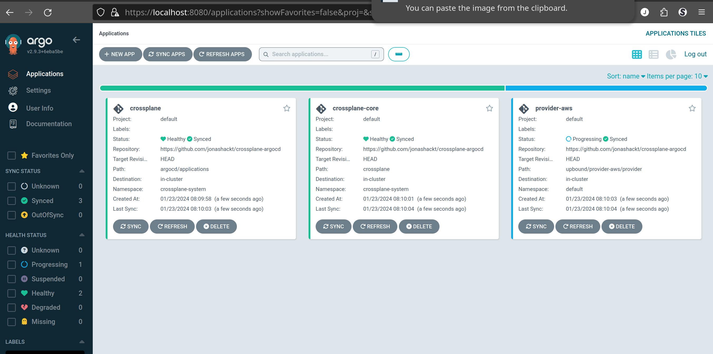


Now if we have a look into `crossplane` App of Apps we see all the needed components to deploy a running Crossplane installation using ArgoCD (which I found is super nice):

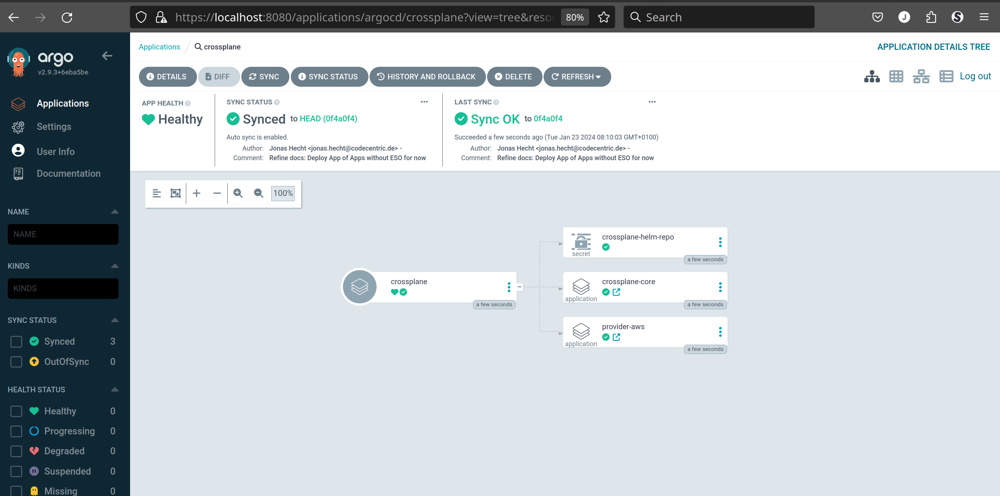


## Doing it all with GitHub Actions

Ok, enough theory :)) Let's create a pipeline that shows stuff works. Let's introduce a [.github/workflows/crossplane-argocd.yml](.github/workflows/crossplane-argocd.yml):

```yaml
name: crossplane-argocd

on: [push]

env:
  KIND_NODE_VERSION: v1.30.4
  # AWS
  AWS_ACCESS_KEY_ID: ${{ secrets.AWS_ACCESS_KEY_ID }}
  AWS_SECRET_ACCESS_KEY: ${{ secrets.AWS_SECRET_ACCESS_KEY }}
  AWS_DEFAULT_REGION: 'eu-central-1'

jobs:
  provision:
    runs-on: ubuntu-latest
    steps:
      - name: Checkout
        uses: actions/checkout@master

      - name: Spin up kind
        run: |          
          echo "--- Create kind cluster"
          kind create cluster --image "kindest/node:$KIND_NODE_VERSION" --wait 5m

          echo "--- Let's try to access our kind cluster via kubectl"
          kubectl get nodes

      - name: Install ArgoCD into kind
        run: |
          echo "--- Create argo namespace and install it"
          kubectl create namespace argocd

          echo " Install & configure ArgoCD via Kustomize - see https://stackoverflow.com/a/71692892/4964553"
          kubectl apply -k argocd/install
          
          echo "--- Wait for Argo to become ready"
          kubectl wait --for=condition=ready pod -l app.kubernetes.io/name=argocd-server --namespace argocd --timeout=300s

      - name: Prepare crossplane AWS Secret
        run: |
          echo "--- Create aws-creds.conf file"
          echo "[default]
          aws_access_key_id = $AWS_ACCESS_KEY_ID
          aws_secret_access_key = $AWS_SECRET_ACCESS_KEY
          " > aws-creds.conf
          
          echo "--- Create a namespace for crossplane"
          kubectl create namespace crossplane-system

          echo "--- Create AWS Provider secret"
          kubectl create secret generic aws-creds -n crossplane-system --from-file=creds=./aws-creds.conf

      - name: Use ArgoCD's AppOfApps pattern to deploy all Crossplane components
        run: |
          echo "--- Let Argo do it's magic installing all Crossplane components"
          kubectl apply -n argocd -f argocd/crossplane-bootstrap.yaml 

      - name: Check crossplane status
        run: |
          echo "--- Wait for crossplane to become ready (now prefaced with until as described in https://stackoverflow.com/questions/68226288/kubectl-wait-not-working-for-creation-of-resources)"
          until kubectl wait --for=condition=PodScheduled pod -l app=crossplane --namespace crossplane-system --timeout=120s > /dev/null 2>&1; do : ; done
          kubectl wait --for=condition=ready pod -l app=crossplane --namespace crossplane-system --timeout=120s

          echo "--- Wait until AWS Provider is up and running (now prefaced with until to prevent Error from server (NotFound): providers.pkg.crossplane.io 'provider-aws-s3' not found)"
          until kubectl get provider/provider-aws-s3 > /dev/null 2>&1; do : ; done
          kubectl wait --for=condition=healthy --timeout=180s provider/provider-aws-s3

          kubectl get all -n crossplane-system
```

Be sure to create both `AWS_ACCESS_KEY_ID` and `AWS_SECRET_ACCESS_KEY` configured as GitHub Repository Secrets:


Also make sure to have your `Default region` configured as a `env:` variable.


## Finally provisioning Cloud resources with Crossplane and Argo

Let's create a simple S3 Bucket in AWS. [The docs tell us](https://marketplace.upbound.io/providers/upbound/provider-aws-s3/v0.47.1/resources/s3.aws.upbound.io/Bucket/v1beta1), which config we need. [`infrastructure/s3/simple-bucket.yaml`](infrastructure/s3/simple-bucket.yaml) features a super simply example:

```yaml
apiVersion: s3.aws.upbound.io/v1beta1
kind: Bucket
metadata:
  name: crossplane-argocd-s3-bucket
spec:
  forProvider:
    region: eu-central-1
  providerConfigRef:
    name: default
```


Since we're using Argo, we should deploy our Bucket as Argo Application too. I created a new folder `argocd/infrastructure`
here, since the Crossplane provisioned infrastructure may not automatically be part of the bootstrap App of Apps.

So here's our Argo Application for all the Crossplane managed infrastructure that may come: [`argocd/infrastructure/aws-s3.yaml`](argocd/infrastructure/aws-s3.yaml):

```yaml
# The ArgoCD Application for all Crossplane Managed Resources
---
apiVersion: argoproj.io/v1alpha1
kind: Application
metadata:
  name: aws-s3
  namespace: argocd
  finalizers:
    - resources-finalizer.argocd.argoproj.io
spec:
  project: default
  source:
    repoURL: https://github.com/jonashackt/crossplane-argocd
    targetRevision: HEAD
    path: infrastructure
  destination:
    namespace: default
    server: https://kubernetes.default.svc
  syncPolicy:
    automated:
      prune: true    
    retry:
      limit: 5
      backoff:
        duration: 5s 
        factor: 2 
        maxDuration: 1m
```

Apply it with:

```shell
kubectl apply -f argocd/infrastructure/aws-s3.yaml
```

If everything went fine, the Argo app should look `Healthy` like this:

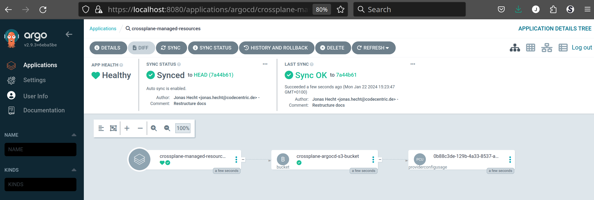

And inside the AWS console, there should be a new S3 Bucket provisioned:

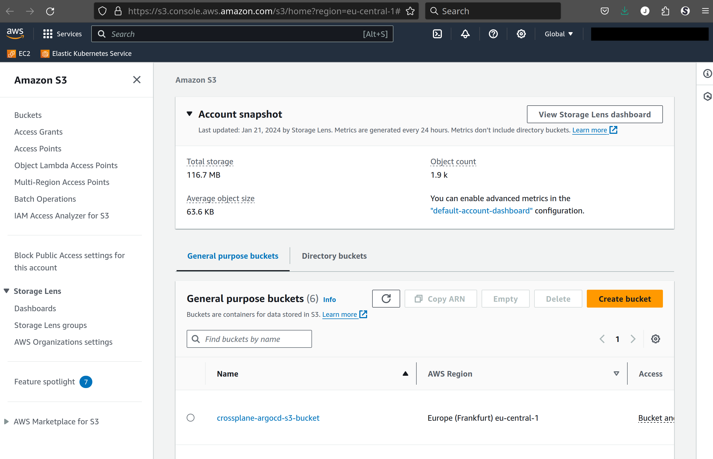


# Getting rid of the manual K8s Secrets creation

CI pushes Secrets into the cluster via `kubectl apply`...

This is an anti-GitOps pattern - so let's do something different!

TODO: Insert why here :) GitOps Pull instead of Push...


After reading through lot's of "How to manage Secrets with GitOps articles" (like [this](https://www.redhat.com/en/blog/a-guide-to-secrets-management-with-gitops-and-kubernetes), [this](https://betterprogramming.pub/why-you-should-avoid-sealed-secrets-in-your-gitops-deployment-e50131d360dd) and [this](https://akuity.io/blog/how-to-manage-kubernetes-secrets-gitops ) to name a few), I found that there's currently no widly accepted way of doing it. But there are some recommendations. E.g. checking Secrets into Git (although encrypted) using [Sealed Secrets](https://github.com/bitnami-labs/sealed-secrets) or [SOPS](https://github.com/getsops/sops)/[KSOPS](https://github.com/viaduct-ai/kustomize-sops) might seem like the kind of easiest solution in the first place. But they have their own caveats in the long therm. Think of multiple secrets defined in multiple projects used by multiple teams all over your Git repositories - and now do a secret or key rotation...


The TLDR; of most (recent) articles and [GitHub discussions](https://github.com/argoproj/argo-cd/issues/1364) I distilled for me is: Use an external secret store and connect that one to your ArgoCD managed cluster. With an external secret store you get key rotation, support for serving secrets as symbolic references, usage audits and so on. Even in the case of secret or key compromisation you mostly get proven mitigations paths. 


## Which tooling to integrate ArgoCD with the external secret store

There is a huge list of possible plugins or operators helping to integrate your ArgoCD managed cluster with an external secret store. You can for example have a look onto [the list featured in the Argo docs](https://argo-cd.readthedocs.io/en/stable/operator-manual/secret-management/). I had a look on some promising candidates:

A lightweight solution could be https://github.com/argoproj-labs/argocd-vault-plugin / https://argocd-vault-plugin.readthedocs.io/en/stable/. It supports multiple backends like AWS Secrets Manager, Azure Key Vault, Hashicorp Vault etc. But the installation [isn't that lightweight](https://argocd-vault-plugin.readthedocs.io/en/stable/installation/), because we need to download the Argo Vault Plugin in a volume and inject it into the `argocd-repo-server` ([although there are pre-build Kustomize manifests available](https://github.com/argoproj-labs/argocd-vault-plugin/blob/main/manifests/cmp-configmap)) by creating a custom argocd-repo-server image with the plugin and supporting tools pre-installed... Also [a newer sidecar option](https://argocd-vault-plugin.readthedocs.io/en/stable/installation/) is available, which nevertheless has [it's own caveats](https://argocd-vault-plugin.readthedocs.io/en/stable/usage/#running-argocd-vault-plugin-in-a-sidecar-container).

There's also [Hashicorps own Vault Agent](https://developer.hashicorp.com/vault/docs/agent-and-proxy/agent) and the [Secrets Store CSI Driver](https://github.com/kubernetes-sigs/secrets-store-csi-driver), who both handle secrets without the need for Kubernetes Secrets. The first works with a per-pod based sidecar approach to connect to Vault via the agent and the latter uses the Container Storage Interface.

Both look nice, but I found the following the most promising solution right now: The [External Secrets Operator (ESO)](https://external-secrets.io/latest/). Featuring also a lot of GitHub stars External Secrets simply creates a Kubernetes Secret for each external secret. According to the docs:

> "ExternalSecret, SecretStore and ClusterSecretStore that provide a user-friendly abstraction for the external API that stores and manages the lifecycle of the secrets for you."

And what's also promising, [the community seems to be growing rapidly](https://github.com/external-secrets/external-secrets):

> "Multiple people and organizations are joining efforts to create a single External Secrets solution based on existing projects."


## Using External Secrets together with Doppler

The External Secrets Operator supports a multitude of tools for secret management! Just have a look at the docs & [you'll see more than 20 tools supported](https://external-secrets.io/latest/provider/aws-secrets-manager/), featuring the well known AWS Secretes Manager, Azure Key Vault, Hashicorp Vault, Akeyless and so on. 

And as I like to show solutions that are fully cromprehensible - ideally without a creditcard - I was on the lookout for a tool, that had a small free plan. But without the need to selfhost the solution, since that would be out of scope for this project. At first glance I thought that [Hashicorp's Vault Secrets](https://developer.hashicorp.com/hcp/docs/vault-secrets) as part of the Hashicorp Cloud Platform (HCP) would be a great choice since so many projects love and use Vault. But sadly External Secrets Operator currently doesn't support HCP Vault Secrets and I would have been forced to [switch to Hashicorp Vault Secrets Operator (VSO)](https://developer.hashicorp.com/hcp/docs/vault-secrets/integrations/kubernetes), which is for sure also an interesting project. But I wanted to stick with the External Secrets Operator since it's wide support for providers and it looks as it could develop into the defacto standard in external secrets integration in Kubernetes.

So I thought the exact secret management tool I use in this case is not that important and I trust my readers that they will choose the provider that suites them the most. That beeing said I chose [Doppler](https://www.doppler.com/) with their [generous free Developer plan](https://www.doppler.com/pricing).

As External-Secrets introduce more complexity to our setup, I decided to divide the crossplane only solution from the more advanced using External Secrets Operator. Therefore the `argocd` directory now looks like this:

```shell
$ tree
.
├── crossplane-bootstrap
│   ├── crossplane.yaml
│   ├── crossplane-helm-secret.yaml
│   └── crossplane-provider-aws.yaml
├── crossplane-eso-bootstrap
│   ├── crossplane.yaml
│   ├── crossplane-helm-secret.yaml
│   ├── crossplane-provider-aws.yaml
│   ├── external-secrets-config.yaml
│   └── external-secrets-operator.yaml
├── crossplane-bootstrap.yaml
├── crossplane-eso-app-of-apps.yaml
...
```

Where `crossplane-bootstrap` and the corresponding `crossplane-bootstrap.yaml` feature the crossplane only solution - and `crossplane-eso-bootstrap` with it's `crossplane-eso-app-of-apps.yaml` App-of-Apps counterpart feature the more advanced ESO solution.


### Create multiline Secret in Doppler

So let's create our first secret in Doppler. If you haven't already done so sign up at https://dashboard.doppler.com (e.g. with your GitHub account). Then click on `Projects` on the left navigation bar and on the `+` to create a new project. In this example I named it according to this example project: `crossplane-argocd`.

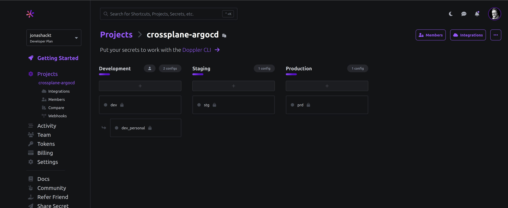

Doppler automatically creates well known environments for us: development, staging and production. To create a new Secret, choose a environment and click on `Add First Secret`. Now give it the key `CREDS`. The value will be a multiline value. Just like [it is stated in the crossplane docs](https://docs.crossplane.io/latest/getting-started/provider-aws/#generate-an-aws-key-pair-file), we should have an `aws-creds.conf` file created already (that we don't want to check into source control):

```shell
echo "[default]
aws_access_key_id = $(aws configure get aws_access_key_id)
aws_secret_access_key = $(aws configure get aws_secret_access_key)
" > aws-creds.conf
```

Copy the contents of the `aws-creds.conf` into the value field in Doppler. The Crossplane AWS Provider or rather it's ProviderConfig will later consume the secret just like it is as multiline text:

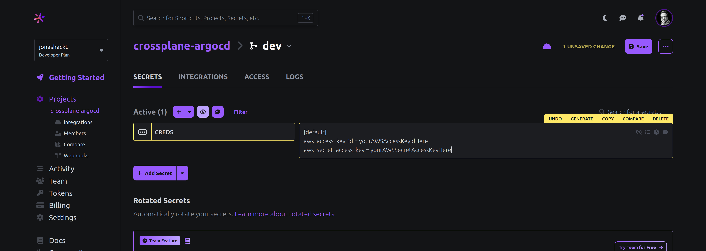

Don't forget so click on `save`. 


### Create Service Token in Doppler project environment

[As stated in the External Secrets docs](https://external-secrets.io/latest/provider/doppler/), we need to create a Doppler Service Token in order to be albe to connect to Doppler later on.

In Doppler Service Tokens are created on project level - inside a specific environment, where we already created our secrets. As I created my secrets in the `dev` environment, I create the Service Token also there. Simply head over to your Doppler project, select the environment you created your secrets in and click on `Access`. Here you should find a button called `+ Generate` to create a new Service Token. Click the button and create a Service Token with `read` access and no expiration and copy it somewhere locally.

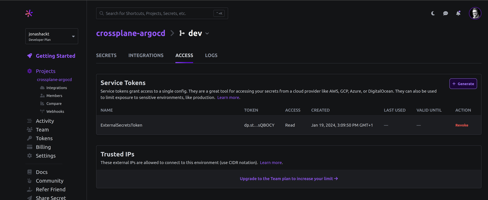


### Create Kubernetes Secret with the Doppler Service Token

In order to be able to let the External Secrets Operator access Doppler, we need to create a Kubernetes `Secret` containing the Doppler Service Token:

```shell
kubectl create secret generic \
    doppler-token-auth-api \
    --from-literal dopplerToken="dp.st.xxxx"
```


### Install External Secrets Operator as ArgoCD Application

https://external-secrets.io/latest/introduction/getting-started/

Installing External Secrets Operator in a GitOps fashion & have updates managed by Renovate, we can use the method already applied to Crossplane and explained in https://stackoverflow.com/a/71765472/4964553. Therefore we create a simple Helm chart at [`external-secrets/Chart.yaml`](external-secrets/Chart.yaml):

```yaml
apiVersion: v2
type: application
name: external-secrets
version: 0.0.0 # unused
appVersion: 0.0.0 # unused
dependencies:
  - name: external-secrets
    repository: https://charts.external-secrets.io
    version: 0.9.11
```

Now telling ArgoCD where to find our simple external-secrets Helm Chart, we again use Argo's `Application` manifest in [argocd/crossplane-eso-bootstrap/external-secrets-operator.yaml](argocd/crossplane-eso-bootstrap/external-secrets-operator.yaml):

```yaml
# The ArgoCD Application for external-secrets-operator
---
apiVersion: argoproj.io/v1alpha1
kind: Application
metadata:
  name: external-secrets-operator
  namespace: argocd
  finalizers:
    - resources-finalizer.argocd.argoproj.io
  annotations:
    argocd.argoproj.io/sync-wave: "0"
spec:
  project: default
  source:
    repoURL: https://github.com/jonashackt/crossplane-argocd
    targetRevision: HEAD
    path: external-secrets/install
  destination:
    server: https://kubernetes.default.svc
    namespace: external-secrets
  syncPolicy:
    automated:
      prune: true    
    syncOptions:
    - CreateNamespace=true
    retry:
      limit: 1
      backoff:
        duration: 5s 
        factor: 2 
        maxDuration: 1m
```

We define the SyncWave to deploy external-secrets before every other Crossplane component via `annotations: argocd.argoproj.io/sync-wave: "-1"`.

Just for checking if it works, we can use a `kubectl apply -f argocd/crossplane-bootstrap/external-secrets.yaml` to apply it to our cluster. If everything went correctly, there should be a new ArgoCD Application featuring a bunch of CRDs, some roles and three Pods: `external-secrets`, `external-secrets-webhook` and `external-secrets-cert-controller`:

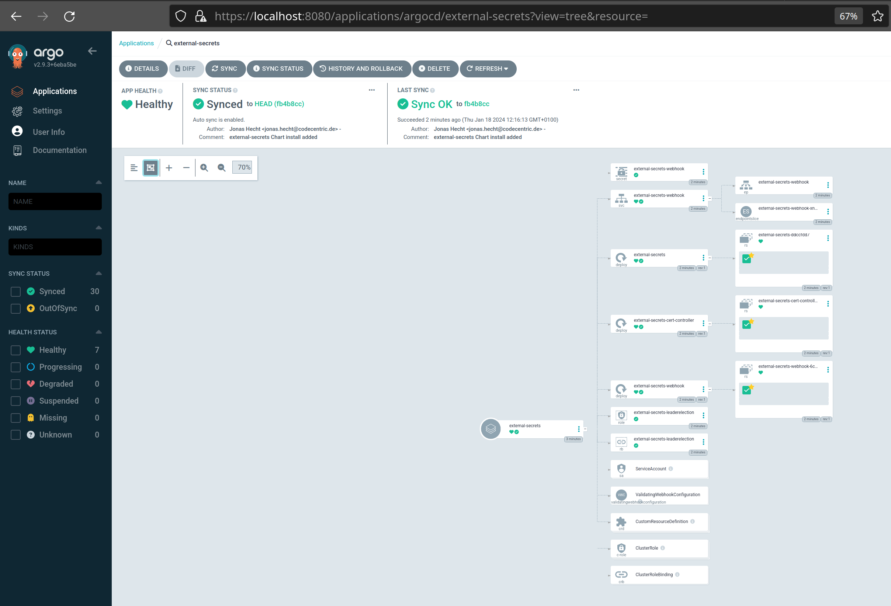


### Create ClusterSecretStore that manages access to Doppler

https://external-secrets.io/latest/provider/doppler/#authentication

https://external-secrets.io/latest/introduction/overview/#secretstore

> The idea behind the `SecretStore` resource is to separate concerns of authentication/access and the actual Secret and configuration needed for workloads. The ExternalSecret specifies what to fetch, the SecretStore specifies how to access. 

In this project I opted for the similar `ClusterSecretStore`. As [the docs state](https://external-secrets.io/latest/introduction/overview/#clustersecretstore):

> "The ClusterSecretStore is a global, cluster-wide SecretStore that can be referenced from all namespaces. You can use it to provide a central gateway to your secret provider."

Sounds like a good fit for our setup. But you can also opt for [the namespaced `SecretStore`](https://external-secrets.io/latest/introduction/overview/#secretstore) too. Our ClusterSecretStore reside here [`external-secrets/config/cluster-secret-store.yaml`](external-secrets/config/cluster-secret-store.yaml):

```yaml
apiVersion: external-secrets.io/v1beta1
kind: ClusterSecretStore
metadata:
  name: doppler-auth-api
spec:
  provider:
    doppler:
      auth:
        secretRef:
          dopplerToken:
            name: doppler-token-auth-api
            key: dopplerToken
            namespace: default
```

Don't forget to configure a `namespace` for the `doppler-token-auth-api` Secret we created earlier. Otherwise we'll run into errors like:

```shell
admission webhook "validate.clustersecretstore.external-secrets.io" denied the request: invalid store: cluster scope requires namespace (retried 1 times).
```

The External Secrets Operator will create a Secret that's similar to the one mentioned in the Crossplane docs (if you decode it), but with the uppercase `CREDS` key we used in Doppler:

```shell
CREDS: |+
[default] 
aws_access_key_id = yourAccessKeyIdHere
aws_secret_access_key = yourSecretAccessKeyHere
```


### Create ExternalSecret to access AWS credentials

https://external-secrets.io/latest/introduction/overview/#externalsecret

https://external-secrets.io/latest/provider/doppler/#use-cases

As we already defined how the external secret store (Doppler) could be accessed (using our `ClusterSecretStore` CRD) should now specify which secrets to fetch using the `ExternalSecret` CRD. Therefore let's create a [`external-secrets/config/external-secret.yaml`](external-secrets/config/external-secret.yaml):

```yaml
apiVersion: external-secrets.io/v1beta1
kind: ExternalSecret
metadata:
  name: auth-api-db-url
spec:
  secretStoreRef:
    kind: ClusterSecretStore
    name: doppler-auth-api

  # access our 'CREDS' key in Doppler
  dataFrom:
    - find:
        path: CREDS

  # Create a Kubernetes Secret just as we're used to without External Secrets Operator
  target:
    name: aws-secrets-from-doppler
```

We created a `CREDS` secret in Doppler, so the `ExternalSecret` looks for this exact path.


We also need to create a ArgoCD Application so that Argo will deploy both `ClusterSecretStore` and `ExternalSecret` for us :) Therefore I created [`argocd/crossplane-eso-bootstrap/external-secrets-config.yaml`](argocd/crossplane-eso-bootstrap/external-secrets-config.yaml):

```yaml
# The ArgoCD Application for external-secrets-operator
---
apiVersion: argoproj.io/v1alpha1
kind: Application
metadata:
  name: external-secrets-config
  namespace: argocd
  finalizers:
    - resources-finalizer.argocd.argoproj.io
  annotations:
    argocd.argoproj.io/sync-wave: "1"
spec:
  project: default
  source:
    repoURL: https://github.com/jonashackt/crossplane-argocd
    targetRevision: HEAD
    path: external-secrets
  destination:
    server: https://kubernetes.default.svc
    namespace: external-secrets
  syncPolicy:
    automated:
      prune: true    
    syncOptions:
    - CreateNamespace=true
    retry:
      limit: 1
      backoff:
        duration: 5s 
        factor: 2 
        maxDuration: 1m
```


Our ClusterSecretStore and ExternalSecrets deployment in Argo looks like this:

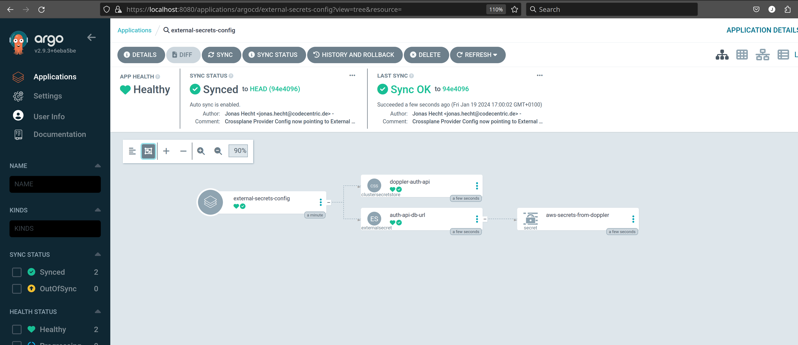

But the deployment doesn't run flawless, although configured as `argocd.argoproj.io/sync-wave: "-1"` right AFTER the `external-secrets` Argo Application, which deployes the External Secrets components:

```shell
Failed sync attempt to 603cce3949c2a916f51f3917e87aa814698e5f92: one or more objects failed to apply, reason: Internal error occurred: failed calling webhook "validate.externalsecret.external-secrets.io": failed to call webhook: Post "https://external-secrets-webhook.external-secrets.svc:443/validate-external-secrets-io-v1beta1-externalsecret?timeout=5s": dial tcp 10.96.42.44:443: connect: connection refused,Internal error occurred: failed calling webhook "validate.clustersecretstore.external-secrets.io": failed to call webhook: Post "https://external-secrets-webhook.external-secrets.svc:443/validate-external-secrets-io-v1beta1-clustersecretstore?timeout=5s": dial tcp 10.96.42.44:443: connect: connection refused (retried 1 times).
```

It seems that our `external-secrets-webhook` isn't healthy already, but the `ClusterSecretStore` & the `ExternalSecret` already want to access the webhook. So we may need to wait for the `external-secrets-webhook` to be really available before we deploy our `external-secrets-config`?!

Therefore let's give our `external-secrets-config` more `syncPolicy.retry.limit`:

```yaml
  syncPolicy:
    ...
    retry:
      limit: 5
      backoff:
        duration: 5s 
        factor: 2 
        maxDuration: 1m
```


### Point the Crossplane AWS ProviderConfig to our External Secret created Secret from Doppler

We need to change our `ProviderConfig` at [`upbound/provider-aws/provider-eos/provider-config-aws.yaml`](upbound/provider-aws/provider-eos/provider-config-aws.yaml) to use another Secret name and namespace: 

```yaml
apiVersion: aws.upbound.io/v1beta1
kind: ProviderConfig
metadata:
  name: default
spec:
  credentials:
    source: Secret
    secretRef:
      namespace: external-secrets
      name: aws-secrets-from-doppler
      key: CREDS
```

With this final piece our setup should be complete to be able to provision some infrastructure with ArgoCD and Crossplane!

Here are all components together we deployed so far using Argo:

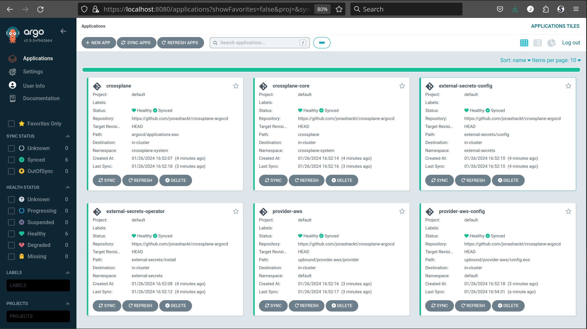

Deploying our [`argocd/infrastructure/aws-s3.yaml`](argocd/infrastructure/aws-s3.yaml) should also work as expected:

```shell
kubectl apply -f argocd/infrastructure/aws-s3.yaml
```

If everything went fine, the Argo app should look `Healthy` like this:


And inside the AWS console, there should be a new S3 Bucket provisioned:


## Adding External Secrets Deployment to GitHub Actions

Let's create another pipeline that shows what differences are to the deployment without External Secrets Operator. Let's introduce a [.github/workflows/crossplane-argocd-external-secrets](.github/workflows/crossplane-argocd-external-secrets):

```yaml
name: crossplane-argocd-external-secrets

on: [push]

env:
  KIND_NODE_VERSION: v1.32.4
  # Doppler
  DOPPLER_SERVICE_TOKEN: ${{ secrets.DOPPLER_SERVICE_TOKEN }}

jobs:
  provision:
    runs-on: ubuntu-latest
    steps:
      - name: Checkout
        uses: actions/checkout@master

      - name: Spin up kind via brew
        run: |          
          echo "--- Create kind cluster"
          kind create cluster --image "kindest/node:$KIND_NODE_VERSION" --wait 5m

          echo "--- Let's try to access our kind cluster via kubectl"
          kubectl get nodes

      - name: Install ArgoCD into kind
        run: |
          echo "--- Create argo namespace and install it"
          kubectl create namespace argocd

          echo " Install & configure ArgoCD via Kustomize - see https://stackoverflow.com/a/71692892/4964553"
          kubectl apply -k argocd/install
          
          echo "--- Wait for Argo to become ready"
          kubectl wait --for=condition=ready pod -l app.kubernetes.io/name=argocd-server --namespace argocd --timeout=300s

      - name: Create Secret with the Doppler Service Token for External Secrets Operator
        run: kubectl create secret generic doppler-token-auth-api --from-literal dopplerToken="$DOPPLER_SERVICE_TOKEN"

      - name: Use ArgoCD's AppOfApps pattern to deploy all Crossplane components
        run: |
          echo "--- Let Argo do it's magic installing all Crossplane components"
          kubectl apply -n argocd -f argocd/crossplane-eso-app-of-apps.yaml 

      - name: Check crossplane status
        run: |
          echo "--- Wait for crossplane to become ready (now prefaced with until as described in https://stackoverflow.com/questions/68226288/kubectl-wait-not-working-for-creation-of-resources)"
          until kubectl wait --for=condition=PodScheduled pod -l app=crossplane --namespace crossplane-system --timeout=120s > /dev/null 2>&1; do : ; done
          kubectl wait --for=condition=ready pod -l app=crossplane --namespace crossplane-system --timeout=120s

          echo "--- Wait until AWS Provider is up and running (now prefaced with until to prevent Error from server (NotFound): providers.pkg.crossplane.io 'provider-aws-s3' not found)"
          until kubectl get provider/provider-aws-s3 > /dev/null 2>&1; do : ; done
          kubectl wait --for=condition=healthy --timeout=180s provider/provider-aws-s3

          kubectl get all -n crossplane-system
```

Be sure to create `DOPPLER_SERVICE_TOKEN` as GitHub Repository Secrets.


# App Deployment

Let's create a publicly accessible S3 bucket in our infrastructure/bucket.yaml:

```yaml
apiVersion: s3.aws.upbound.io/v1beta1
kind: Bucket
metadata:
  name: crossplane-argocd-s3-bucket
spec:
  forProvider:
    region: eu-central-1
  providerConfigRef:
    name: default
---
apiVersion: s3.aws.upbound.io/v1beta1
kind: BucketPublicAccessBlock
metadata:
  name: crossplane-argocd-s3-bucket-pab
spec:
  forProvider:
    blockPublicAcls: false
    blockPublicPolicy: false
    ignorePublicAcls: false
    restrictPublicBuckets: false
    bucketRef: 
      name: crossplane-argocd-s3-bucket
    region: eu-central-1
---
apiVersion: s3.aws.upbound.io/v1beta1
kind: BucketOwnershipControls
metadata:
  name: crossplane-argocd-s3-bucket-osc
spec:
  forProvider:
    rule:
      - objectOwnership: ObjectWriter
    bucketRef: 
      name: crossplane-argocd-s3-bucket
    region: eu-central-1
---
apiVersion: s3.aws.upbound.io/v1beta1
kind: BucketACL
metadata:
  name: crossplane-argocd-s3-bucket-acl
spec:
  forProvider:
    acl: "public-read"
    bucketRef: 
      name: crossplane-argocd-s3-bucket
    region: eu-central-1
---
apiVersion: s3.aws.upbound.io/v1beta1
kind: BucketWebsiteConfiguration
metadata:
  name: crossplane-argocd-s3-bucket-websiteconf
spec:
  forProvider:
    indexDocument:
      - suffix: index.html
    bucketRef: 
      name: crossplane-argocd-s3-bucket
    region: eu-central-1
```


Also let's sync the Nuxt.js project https://github.com/jonashackt/microservice-ui-nuxt-js via the used `aws s3 sync`:

```shell
aws s3 sync .output/public/ s3://crossplane-argocd-s3-bucket --acl public-read
```

And we should be able to access our via http://crossplane-argocd-s3-bucket.s3-website.eu-central-1.amazonaws.com


## Deploy a static website with ArgoCD?

Application sources are generally Kubernetes manifests in Argo https://argo-cd.readthedocs.io/en/stable/user-guide/application_sources/

So how do we actually deploy our static website to S3?

https://www.reddit.com/r/kubernetes/comments/17qsi5b/is_there_a_kubernetes_way_of_deploying_static_web/

According to https://github.com/argoproj/argo-cd/discussions/5052 there's the way to use custom Config Management Plugins https://argo-cd.readthedocs.io/en/stable/operator-manual/config-management-plugins/


Proposal for Parameterized Configuration Management Plugins in Argo: https://argo-cd.readthedocs.io/en/latest/proposals/parameterized-config-management-plugins/


But maybe we should simply deploy our static website to K8s as well? https://gimlet.io/blog/hosting-static-sites-on-kubernetes

https://thenewstack.io/gitops-as-an-evolution-of-kubernetes/


## Deploy an EKS Cluster

### Multiple AWS Providers as ArgoCD Application

To be able to deploy a [nested Composition like this for EKS](https://github.com/jonashackt/crossplane-eks-cluster) we need to install multiple Crossplane Providers: `provider-aws-ec2`, `provider-aws-eks`, `provider-aws-iam` additionally to our already installed `provider-aws-s3`. Therefore we should enhance our concept on how to install a Provider with ArgoCD!

Since every Upbound provider family has one ProviderConfig to access the credentials, but multiple providers, it would make sense to enhance the Argo Application `argocd/crossplane-bootstrap/crossplane-provider-aws.yaml` to support multiple providers:

```yaml
# The ArgoCD Application for all Crossplane AWS providers incl. it's ProviderConfig
---
apiVersion: argoproj.io/v1alpha1
kind: Application
metadata:
  name: crossplane-provider-aws
  namespace: argocd
  labels:
    crossplane.jonashackt.io: crossplane
  finalizers:
    - resources-finalizer.argocd.argoproj.io
  annotations:
    argocd.argoproj.io/sync-wave: "2"
spec:
  project: default
  source:
    repoURL: https://github.com/jonashackt/crossplane-argocd
    targetRevision: HEAD
    path: upbound/provider-aws/provider
  destination:
    namespace: default
    server: https://kubernetes.default.svc
  # Using syncPolicy.automated here, otherwise the deployement of our Crossplane provider will fail with
  # 'Resource not found in cluster: pkg.crossplane.io/v1/Provider:provider-aws-s3'
  syncPolicy:
    automated:
      prune: true    
    retry:
      limit: 5
      backoff:
        duration: 5s 
        factor: 2 
        maxDuration: 1m
```

Thus this Application simply references the folder `upbound/provider-aws/provider`, where all the `Provider` manifests can be stored:

```shell
└── provider-aws
    ...
    ├── config
    │   └── provider-config-aws.yaml
    ...
    └── provider
        ├── provider-aws-ec2.yaml
        ├── provider-aws-eks.yaml
        ├── provider-aws-iam.yaml
        └── provider-aws-s3.yaml
```

Now in Argo, the Application shows all available Crossplane providers:

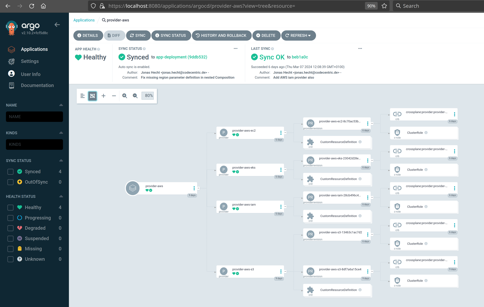


#### Provider Upgrade problems: 'Only one reference can have Controller set to true'

If new Provider versions get released, you can watch Argo trying to deploy the old version vs. Crossplane deploying the new one, which leads to a `degraded` status of the Providers:

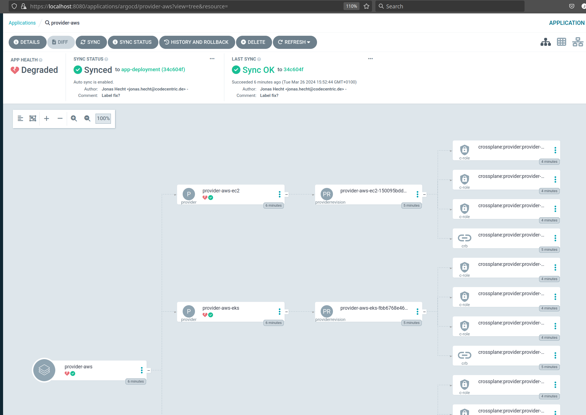

The problem is this error: `Only one reference can have Controller set to true. Found "true" in references for Provider/provider-aws-ec2 and Provider/provider-aws-ec2`:

```shell
cannot apply package revision: cannot create object: ProviderRevision.pkg.crossplane.io "provider-aws-ec2-150095bdd614" is invalid: metadata.ownerReferences: Invalid value: []v1.OwnerReference{v1.OwnerReference{APIVersion:"pkg.crossplane.io/v1", Kind:"Provider", Name:"provider-aws-ec2", UID:"30bda236-6c12-412c-a647-b96368eff8b6", Controller:(*bool)(0xc02afeb38c), BlockOwnerDeletion:(*bool)(0xc02afeb38d)}, v1.OwnerReference{APIVersion:"pkg.crossplane.io/v1", Kind:"Provider", Name:"provider-aws-ec2", UID:"ee890f53-7590-4957-8f81-e92b931c4e8d", Controller:(*bool)(0xc02afeb38e), BlockOwnerDeletion:(*bool)(0xc02afeb38f)}}: Only one reference can have Controller set to true. Found "true" in references for Provider/provider-aws-ec2 and Provider/provider-aws-ec2
```

Therefore we should change some options regarding the Provider upgrades in our Provider configurations:

```yaml
apiVersion: pkg.crossplane.io/v1
kind: Provider
metadata:
  name: upbound-provider-aws-ec2
spec:
  package: xpkg.upbound.io/upbound/provider-aws-ec2:v1.1.1
  packagePullPolicy: IfNotPresent # Only download the package if it isn’t in the cache.
  revisionActivationPolicy: Automatic # Otherwise our Provider never gets activate & healthy
  revisionHistoryLimit: 1
```

As we're doing GitOpsified Crossplane with ArgoCD, we should configure the `packagePullPolicy` to `IfNotPresent` instead of `Always` (which means " Check for new packages every minute and download any matching package that isn’t in the cache", see https://docs.crossplane.io/master/concepts/packages/#configuration-package-pull-policy) - BUT leave the `revisionActivationPolicy` to `Automatic`! Since otherwise, the Provider will never get active and healty! See https://docs.crossplane.io/master/concepts/packages/#revision-activation-policy), but I didn't find it documented that way!


#### GitOpsified Provider Upgrade

See also https://stackoverflow.com/a/78230499/4964553

Now with `packagePullPolicy: IfNotPresent` & `revisionActivationPolicy: Automatic` to do a Provider version upgrade, we simply need to upgrade the `spec.package` version number:

```yaml
spec:
  package: xpkg.upbound.io/upbound/provider-aws-ec2:v1.2.1 # --> Upgraded to 1.2.1
  packagePullPolicy: IfNotPresent # Only download the package if it isn’t in the cache.
  revisionActivationPolicy: Automatic # Otherwise our Provider never gets activate & healthy
  revisionHistoryLimit: 1
```

We need to commit the change as always, but also be a bit patient here with Argo and Crossplane to initiate and do the update for us. Look at a `kubectl get providerrevisions`. Even after the update commited and registered by Argo, Crossplane will take it's time. First it looks like this:

```shell
k get providerrevisions
NAME                                       HEALTHY   REVISION   IMAGE                                                STATE      DEP-FOUND   DEP-INSTALLED   AGE
provider-aws-ec2-3d66ea2d7903              True      1          xpkg.upbound.io/upbound/provider-aws-ec2:v1.2.1      Active     1           1               5m31s
provider-aws-eks-5021e69b327c              True      2          xpkg.upbound.io/upbound/provider-aws-eks:v1.2.1      Inactive   1           1               4m11s
provider-aws-eks-fbb6768e46c0              True      3          xpkg.upbound.io/upbound/provider-aws-eks:v1.1.1      Active     1           1               30m
provider-aws-iam-9565c6312cd0              True      1          xpkg.upbound.io/upbound/provider-aws-iam:v1.1.1      Active     1           1               30m
provider-aws-s3-6ca829a5198b               True      1          xpkg.upbound.io/upbound/provider-aws-s3:v1.1.1       Active     1           1               30m
upbound-provider-family-aws-7cc64a779806   True      1          xpkg.upbound.io/upbound/provider-family-aws:v1.2.1   Active                                 30m
```

Now after a while and some events (look at them in `k9s` for example):

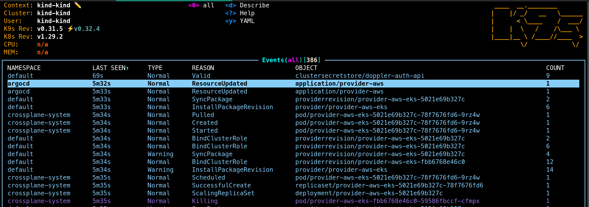

Some time later the new Provider version should be the `Active` one:

```shell
k get providerrevisions
NAME                                       HEALTHY   REVISION   IMAGE                                                STATE      DEP-FOUND   DEP-INSTALLED   AGE
provider-aws-ec2-3d66ea2d7903              True      1          xpkg.upbound.io/upbound/provider-aws-ec2:v1.2.1      Active     1           1               6m52s
provider-aws-eks-5021e69b327c              True      4          xpkg.upbound.io/upbound/provider-aws-eks:v1.2.1      Active     1           1               5m32s
provider-aws-eks-fbb6768e46c0              True      3          xpkg.upbound.io/upbound/provider-aws-eks:v1.1.1      Inactive   1           1               31m
provider-aws-iam-9565c6312cd0              True      1          xpkg.upbound.io/upbound/provider-aws-iam:v1.1.1      Active     1           1               31m
provider-aws-s3-6ca829a5198b               True      1          xpkg.upbound.io/upbound/provider-aws-s3:v1.1.1       Active     1           1               31m
upbound-provider-family-aws-7cc64a779806   True      1          xpkg.upbound.io/upbound/provider-family-aws:v1.2.1   Active                                 31m
```

And luckily without any errors like mentioned above!


### Using the EKS Nested Composition as Configuration Package

I offloaded all the EKS Nested Composition as a separate repository, which publishes a Crossplane Configuration Package as OCI image: https://github.com/jonashackt/crossplane-eks-cluster

We should be able to use it via the following Configuration:

```yaml
apiVersion: pkg.crossplane.io/v1
kind: Configuration
metadata:
  name: crossplane-eks-cluster
spec:
  package: ghcr.io/jonashackt/crossplane-eks-cluster:v0.0.2
```

Let's try to apply it to our cluster and use it:

```shell
kubectl apply -f upbound/provider-aws/apis/crossplane-eks-cluster.yaml
```


### GitOpsify API installation: Use EKS Cluster Configuration in Argo Application

We should create an Argo Application for our EKS Configuration package to make Argo manage it's versions for us (which also makes the EKS Configuration viewable in Argo UI)!

Therefore let's create a new folder `argocd/crossplane-apis` and a new `Application` [`argocd/crossplane-apis/crossplane-apis.yaml`](argocd/crossplane-apis/crossplane-apis.yaml):

```yaml
# The ArgoCD Application for all Crossplane Managed Resources
---
apiVersion: argoproj.io/v1alpha1
kind: Application
metadata:
  name: crossplane-apis
  namespace: argocd
  finalizers:
    - resources-finalizer.argocd.argoproj.io
spec:
  project: default
  source:
    repoURL: https://github.com/jonashackt/crossplane-argocd
    targetRevision: app-deployment
    path: upbound/provider-aws/apis
  destination:
    namespace: default
    server: https://kubernetes.default.svc
  syncPolicy:
    automated:
      prune: true    
    retry:
      limit: 5
      backoff:
        duration: 5s 
        factor: 2 
        maxDuration: 1m
```

Now we can apply this `crossplane-apis` Application to our ArgoCD:

```shell
kubectl apply -f argocd/crossplane-apis/crossplane-apis.yaml
```

That's pretty cool: Now we see all of our installed APIs as Argo Apps:

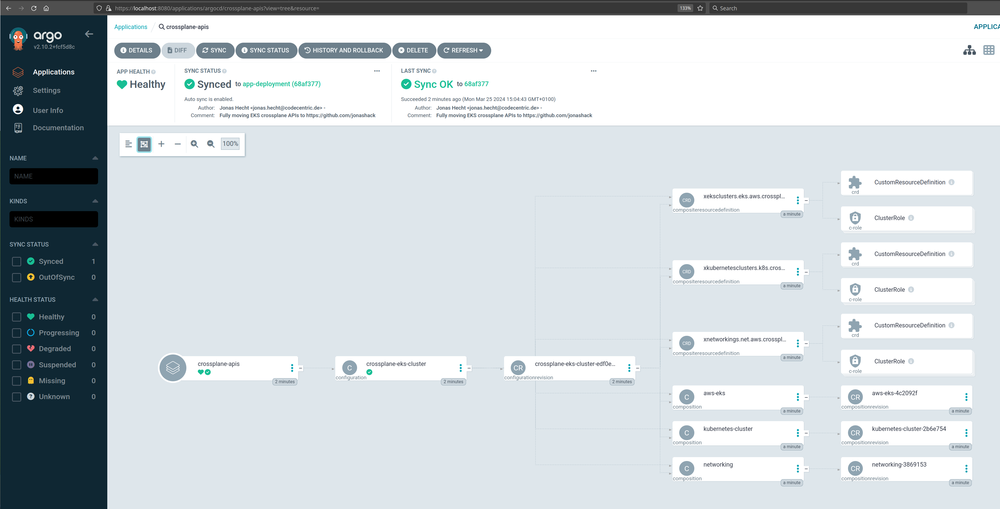


### Craft a Composite Resource Claim (XRC) to provision an EKS cluster

Now we use our installed APIs to create a Claim in [`infrastructure/eks/deploy-target-eks.yaml`](infrastructure/eks/deploy-target-eks.yaml):

```yaml
# Use the spec.group/spec.versions[0].name defined in the XRD
apiVersion: k8s.crossplane.jonashackt.io/v1alpha1
# Use the spec.claimName or spec.name specified in the XRD
kind: KubernetesCluster
metadata:
  namespace: default
  name: deploy-target-eks
spec:
  id: deploy-target-eks
  parameters:
    region: eu-central-1
    nodes:
      count: 3
  # Crossplane creates the secret object in the same namespace as the Claim
  # see https://docs.crossplane.io/latest/concepts/claims/#claim-connection-secrets
  writeConnectionSecretToRef:
    name: eks-cluster-kubeconfig
```

Don't apply it directly, we'll create a Argo App in a second.


### Crossplane Composite Resource Claims (XRCs) as Argo Application

We should also create a Argo App for our EKS cluster Composite Resource Claim to see our infrastructure beeing deployed visually :)

Therefore we create the Application [`argocd/infrastructure/aws-eks.yaml`](argocd/infrastructure/aws-eks.yaml):

```yaml
# The ArgoCD Application for all Crossplane Managed Resources
---
apiVersion: argoproj.io/v1alpha1
kind: Application
metadata:
  name: crossplane-eks
  namespace: argocd
  finalizers:
    - resources-finalizer.argocd.argoproj.io
spec:
  project: default
  source:
    repoURL: https://github.com/jonashackt/crossplane-argocd
    targetRevision: app-deployment
    path: infrastructure/eks
  destination:
    namespace: default
    server: https://kubernetes.default.svc
  syncPolicy:
    automated:
      prune: true    
    retry:
      limit: 5
      backoff:
        duration: 5s 
        factor: 2 
        maxDuration: 1m
```

Now **this** will deploy our EKS cluster using ArgoCD and our EKS Configuration Package based Nested EKS Composition https://github.com/jonashackt/crossplane-eks-cluster:

```shell
kubectl apply -f argocd/infrastructure/aws-eks.yaml
```


### Add the new EKS cluster as a new ArgoCD deploy target

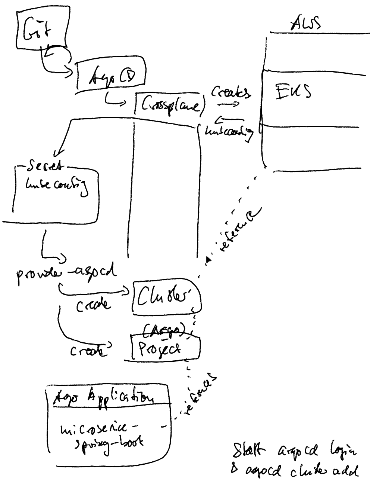


https://dev.to/thenjdevopsguy/registering-a-new-cluster-with-argocd-12mn

https://www.padok.fr/en/blog/argocd-eks

https://itnext.io/argocd-setup-external-clusters-by-name-d3d58a53acb0


Before using `argocd` CLI, be sure to have logged the CLI into the current argocd-server instance. Therefore have a port forward ready

```shell
$ kubectl port-forward -n argocd --address='0.0.0.0' service/argocd-server 8080:80

$ argocd login localhost:8080 --username admin --password $(kubectl -n argocd get secret argocd-initial-admin-secret -o jsonpath="{.data.password}" | base64 -d; echo) --insecure
'admin:login' logged in successfully
Context 'localhost:8080' updated
```

https://argo-cd.readthedocs.io/en/stable/user-guide/commands/argocd_cluster_add/

```shell
argocd cluster add deploy-target-eks
```

This will add a few resources to the Target cluster like `ServiceAccount`, `ClusterRole` and `ClusterRoleBinding`:

```shell
$ argocd cluster add deploy-target-eks
WARNING: This will create a service account `argocd-manager` on the cluster referenced by context `deploy-target-eks` with full cluster level privileges. Do you want to continue [y/N]? y
INFO[0002] ServiceAccount "argocd-manager" already exists in namespace "kube-system" 
INFO[0002] ClusterRole "argocd-manager-role" updated    
INFO[0002] ClusterRoleBinding "argocd-manager-role-binding" updated 
Cluster 'https://736F91649BD7B7A70846AD9F8363EDA8.yl4.eu-central-1.eks.amazonaws.com' added
```

The new cluster becomes visible in the Argo web ui also:

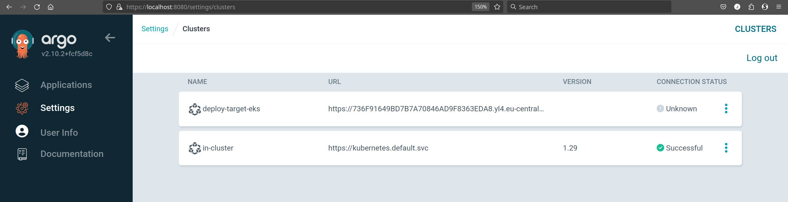


### Add new EKS clusters declaratively to ArgoCD

Is there only the `argocd cluster add` command or could we achieve that using a manifest?

https://github.com/argoproj/argo-cd/issues/8107

Maybe the Crossplane ArgoCD Provider has the crucial Manifest for us? See https://github.com/crossplane-contrib/provider-argocd/issues/18 and https://marketplace.upbound.io/providers/crossplane-contrib/provider-argocd/v0.6.0/resources/cluster.argocd.crossplane.io/Cluster/v1alpha1


You might already wondered, what the Crossplane ArgoCD provider is about: https://marketplace.upbound.io/providers/crossplane-contrib/provider-argocd

Thats what the project README says https://github.com/crossplane-contrib/provider-argocd about it's purpose:

> Custom Resource Definitions (CRDs) that model Argo CD resources

With this we can create a [`Cluster`](https://marketplace.upbound.io/providers/crossplane-contrib/provider-argocd/v0.6.0/resources/cluster.argocd.crossplane.io/Cluster/v1alpha1) which is able to represent the EKS cluster we just created. This Cluster itself can be referenced again by an ArgoCD Application managing for example our Spring Boot application we finally want to deploy.


#### Install Crossplane ArgoCD Provider

> The whole process might become more straightforward in the future: https://github.com/crossplane-contrib/provider-argocd/issues/14#issuecomment-1879101376

So let's install the Crossplane ArgoCD provider, which is a community contribution project. Thus we create the `crossplane-contrib` folder containing a `provider-argocd` folder, where the new Provider should reside as `provider-argocd.yaml` in the `provider` dir:

```yaml
apiVersion: pkg.crossplane.io/v1
kind: Provider
metadata:
  name: provider-argocd
spec:
  package: xpkg.upbound.io/crossplane-contrib/provider-argocd:v0.6.0
  packagePullPolicy: IfNotPresent # Only download the package if it isn’t in the cache.
  revisionActivationPolicy: Automatic # Otherwise our Provider never gets activate & healthy
  revisionHistoryLimit: 1
```

As we want to manage the Provider also using Argo, we need to create a new Argo Application. It get's the same `argocd.argoproj.io/sync-wave: "4"` as the other providers in our setup:

```yaml
# The ArgoCD Application for all Crossplane Community contribution Providers needed in the setup
---
apiVersion: argoproj.io/v1alpha1
kind: Application
metadata:
  name: crossplane-provider-contrib
  namespace: argocd
  labels:
    crossplane.jonashackt.io: crossplane
  finalizers:
    - resources-finalizer.argocd.argoproj.io
  annotations:
    argocd.argoproj.io/sync-wave: "4"
spec:
  project: default
  source:
    repoURL: https://github.com/jonashackt/crossplane-argocd
    targetRevision: app-deployment
    path: crossplane-contrib
  destination:
    namespace: default
    server: https://kubernetes.default.svc
  # Using syncPolicy.automated here, otherwise the deployement of our Crossplane provider will fail with
  # 'Resource not found in cluster: pkg.crossplane.io/v1/Provider:provider-aws-s3'
  syncPolicy:
    automated:
      prune: true    
    retry:
      limit: 5
      backoff:
        duration: 5s 
        factor: 2 
        maxDuration: 1m
```

Apply it via the ususal bootstrap setup:

```shell
kubectl apply -f argocd/crossplane-eso-bootstrap.yaml
```

Argo should now list our new Provider:

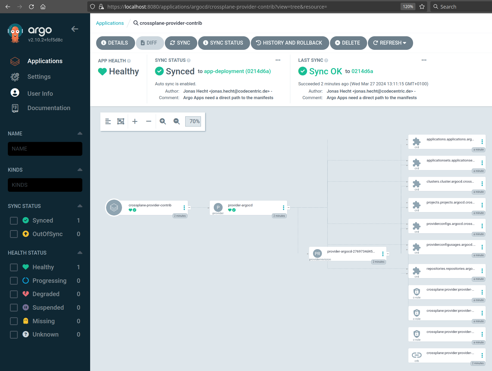


#### Create ArgoCD user & RBAC role for Crossplane ArgoCD Provider

As stated in the docs https://github.com/crossplane-contrib/provider-argocd?tab=readme-ov-file#create-a-new-argo-cd-user we need to create an API token for the `ProviderConfig` of the Crossplane ArgoCD provider to use. To create the API token, we first need to create a new ArgoCD user.

Therefore we enhance [the ConfigMap `argocd-cm`](argocd/install/argocd-cm-patch.yaml) again:

```yaml
apiVersion: v1
kind: ConfigMap
metadata:
  name: argocd-cm
data:
  ...
  # add an additional local user with apiKey capabilities for provider-argocd
  # see https://github.com/crossplane-contrib/provider-argocd?tab=readme-ov-file#getting-started-and-documentation
  accounts.provider-argocd: apiKey      
```

As [the ArgoCD docs about user management](https://argo-cd.readthedocs.io/en/stable/operator-manual/user-management/#local-usersaccounts) state this is not enough:

> "each of those users will need additional RBAC rules set up, otherwise they will fall back to the default policy specified by policy.default field of the `argocd-rbac-cm` ConfigMap."

So we need to create another Kustomization patch for [the `argocd-rbac-cm` ConfigMap](argocd/install/argocd-rbac-cm-patch.yaml):

```yaml
apiVersion: v1
kind: ConfigMap
metadata:
  name: argocd-rbac-cm
data:
  # For the provider-argocd user we need to add an additional rbac-rule
  # see https://github.com/crossplane-contrib/provider-argocd?tab=readme-ov-file#create-a-new-argo-cd-user
  policy.csv: "g, provider-argocd, role:admin"      
```

Don't forget to add this patch into the []`kustomization.yaml`](argocd/install/kustomization.yaml)!


#### Create API Token for Crossplane ArgoCD Provider

First we need to access the `argocd-server` Service somehow. In the simplest manner we create a port forward:

```shell
kubectl port-forward -n argocd --address='0.0.0.0' service/argocd-server 8443:443
```

We also need to have the ArgoCD password ready:

```shell
ARGOCD_ADMIN_SECRET=$(kubectl -n argocd get secret argocd-initial-admin-secret -o jsonpath="{.data.password}" | base64 -d; echo)
```

Now we create a temporary JWT token for the `provider-argocd` user we just created (we need to have [`jq`](https://jqlang.github.io/jq/) installed for this command to work):

```shell
# be sure to have jq installed via 'brew install jq' or 'pamac install jq' etc.

ARGOCD_ADMIN_TOKEN=$(curl -s -X POST -k -H "Content-Type: application/json" --data '{"username":"admin","password":"'$ARGOCD_ADMIN_SECRET'"}' https://localhost:8443/api/v1/session | jq -r .token)
```

Now we finally create an API token without expiration that can be used by `provider-argocd`:

```shell
ARGOCD_API_TOKEN=$(curl -s -X POST -k -H "Authorization: Bearer $ARGOCD_ADMIN_TOKEN" -H "Content-Type: application/json" https://localhost:8443/api/v1/account/provider-argocd/token | jq -r .token)
```

You can double check in the ArgoCD UI at `Settings/Accounts` if the Token got created:

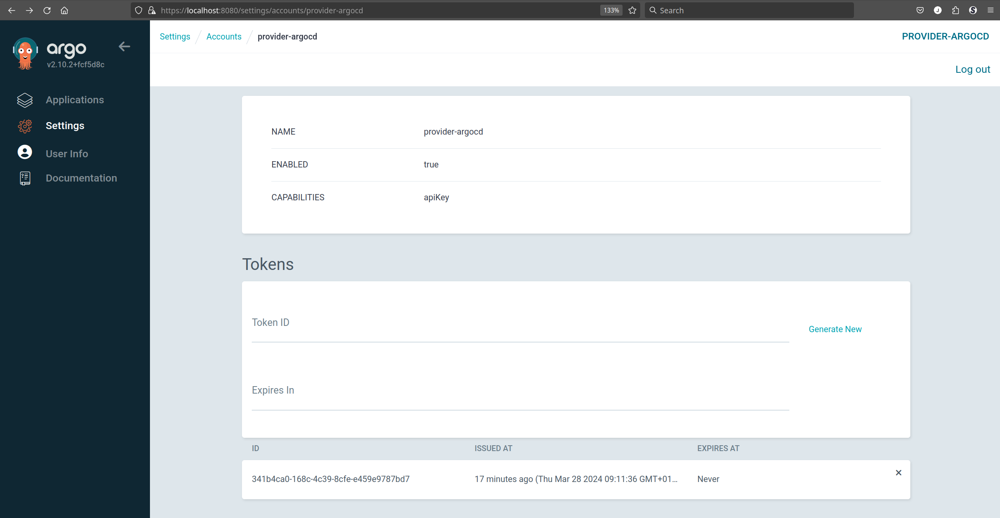


#### Create Secret containing the ARGOCD_API_TOKEN

https://github.com/crossplane-contrib/provider-argocd?tab=readme-ov-file#setup-crossplane-provider-argocd

The `ARGOCD_API_TOKEN` can be used to create a Kubernetes Secret for the Crossplane ArgoCD Provider:

```shell
kubectl create secret generic argocd-credentials -n crossplane-system --from-literal=authToken="$ARGOCD_API_TOKEN"
```

I also added all these steps to a script [`create-argocd-api-token-secret.sh`](create-argocd-api-token-secret.sh) so that we're able to run all the steps without much thinking:

```shell
#!/usr/bin/env bash
set -euo pipefail

echo "### This Script will prepare a K8s Secret with a ArgoCD API Token for Crossplane ArgoCD Provider (be sure to have a service/argocd-server 8443:443 running before)"

echo "--- Extract ArgoCD password"
ARGOCD_ADMIN_SECRET=$(kubectl -n argocd get secret argocd-initial-admin-secret -o jsonpath="{.data.password}" | base64 -d; echo)

echo "--- Create temporary JWT token for the provider-argocd user"
ARGOCD_ADMIN_TOKEN=$(curl -s -X POST -k -H "Content-Type: application/json" --data '{"username":"admin","password":"'$ARGOCD_ADMIN_SECRET'"}' https://localhost:8443/api/v1/session | jq -r .token)

echo "--- Create ArgoCD API Token"
ARGOCD_API_TOKEN=$(curl -s -X POST -k -H "Authorization: Bearer $ARGOCD_ADMIN_TOKEN" -H "Content-Type: application/json" https://localhost:8443/api/v1/account/provider-argocd/token | jq -r .token)

echo "--- Already create a namespace for crossplane for the Secret (if not already exist, see https://stackoverflow.com/a/65411733/4964553)"
kubectl create namespace crossplane-system --dry-run=client -o yaml | kubectl apply -f -

echo "--- Create Secret containing the ARGOCD_API_TOKEN for Crossplane ArgoCD Provider"
kubectl create secret generic argocd-credentials -n crossplane-system --from-literal=authToken="$ARGOCD_API_TOKEN"
```

Now all the steps to create the Secret for the Crossplane argocd-provider can be run via a simple:

```shell
kubectl port-forward -n argocd --address='0.0.0.0' service/argocd-server 8443:443
bash create-argocd-api-token-secret.sh
```

> The `kubectl port-forward` command can be run in subshell appending ` &` + `Ctrl-C` and beeing deleted after running create-argocd-api-token-secret.sh via `fg 1%` (where 1 is the subshell id, obtain via `jobs` command) + `Ctrl-C` (see https://stackoverflow.com/a/72983554/4964553 & https://www.baeldung.com/linux/foreground-background-process).

Our GitHub Actions workflow now also integrates the Secret creation:

```yaml
      - name: Prepare Secret with ArgoCD API Token for Crossplane ArgoCD Provider
        run: |
          echo "--- Access the ArgoCD server with a port-forward in the background, see https://stackoverflow.com/a/72983554/4964553"
          kubectl port-forward -n argocd --address='0.0.0.0' service/argocd-server 8443:443 &
          
          echo "--- Wait shortly to let the port forward come available"
          sleep 5

          bash create-argocd-api-token-secret.sh
```

As you can see we use a `sleep 5` timer here in order to let the `kubectl port-forward` to become ready. Otherwise will run into a `Error: Process completed with exit code 7.` like this::

```shell
--- Access the ArgoCD server with a port-forward in the background, see https://stackoverflow.com/a/72983554/4964553
### This Script will prepare a K8s Secret with a ArgoCD API Token for Crossplane ArgoCD Provider (be sure to have a service/argocd-server 8443:443 running before)
--- Extract ArgoCD password
--- Create temporary JWT token for the provider-argocd user
Forwarding from 0.0.0.0:8443 -> 8080
Error: Process completed with exit code 7.
```


#### Configure Crossplane ArgoCD Provider

Now finally we're able to tell our Crossplane ArgoCD Provider where it should obtain the ArgoCD API Token from. Let's create a ProviderConfig at [`crossplane-contrib/provider-argocd/config/provider-config-argocd.yaml`](crossplane-contrib/provider-argocd/config/provider-config-argocd.yaml):


```yaml
apiVersion: argocd.crossplane.io/v1alpha1
kind: ProviderConfig
metadata:
  name: argocd-provider
spec:
  credentials:
    secretRef:
      key: authToken
      name: argocd-credentials
      namespace: crossplane-system
    source: Secret
  insecure: true
  plainText: false
  serverAddr: argocd-server.argocd.svc:443
```

We should also create [a ArgoCD Application for the ProviderConfig](argocd/crossplane-eso-bootstrap/crossplane-provider-argocd-config.yaml):

```yaml
# The ArgoCD Application for the Crossplane ArgoCD providers ProviderConfig
---
apiVersion: argoproj.io/v1alpha1
kind: Application
metadata:
  name: crossplane-provider-argocd-config
  namespace: argocd
  labels:
    crossplane.jonashackt.io: crossplane
  finalizers:
    - resources-finalizer.argocd.argoproj.io
  annotations:
    argocd.argoproj.io/sync-wave: "5"
spec:
  project: default
  source:
    repoURL: https://github.com/jonashackt/crossplane-argocd
    targetRevision: app-deployment
    path: crossplane-contrib/provider-argocd/config
  destination:
    namespace: default
    server: https://kubernetes.default.svc
  syncPolicy:
    automated:
      prune: true    
    retry:
      limit: 5
      backoff:
        duration: 5s 
        factor: 2 
        maxDuration: 1m
```


#### Create a Cluster in ArgoCD referencing our Crossplane created EKS cluster

Now we're where we wanted to be: We can finally create a Cluster in ArgoCD referencing the Crossplane created EKS cluster. Therefore we make use of the [Crossplane ArgoCD Providers Cluster CRD](https://marketplace.upbound.io/providers/crossplane-contrib/provider-argocd/v0.6.0/resources/cluster.argocd.crossplane.io/Cluster/v1alpha1) in our [`infrastructure/eks/cluster.yaml`](infrastructure/eks/cluster.yaml):

```yaml
apiVersion: cluster.argocd.crossplane.io/v1alpha1
kind: Cluster
metadata:
  name: argo-reference-deploy-target-eks
  labels:
    purpose: dev
spec:
  forProvider:
    config:
      kubeconfigSecretRef:
        key: kubeconfig
        name: eks-cluster-kubeconfig # Secret containing our kubeconfig to access the Crossplane created EKS cluster
        namespace: default
    name: deploy-target-eks # name of the Cluster registered in ArgoCD
  providerConfigRef:
    name: argocd-provider
```

> **Be sure** to provide the `forProvider.name` **AFTER** the `forProvider.config`, otherwise the name of the Cluster *will we overwritten by the EKS server address from the kubeconfig*!

The `providerConfigRef.name.argocd-provider` references our `ProviderConfig`, which gives the Crossplane ArgoCD Provider the rights (via our API Token) to change the ArgoCD Server configuration (and thus add a new Cluster).

As the docs state https://marketplace.upbound.io/providers/crossplane-contrib/provider-argocd/v0.6.0/resources/cluster.argocd.crossplane.io/Cluster/v1alpha1

`kubeconfigSecretRef' is described at what we need: 

> KubeconfigSecretRef contains a reference to a Kubernetes secret entry that contains a raw kubeconfig in YAML or JSON. 

The Secret containing the exact EKS kubeconfig is named `eks-cluster-kubeconfig` by our EKS Configuration and resides in the `default` namespace.

Let's create the Cluster manually for now:

```shell
kubectl apply -f infrastructure/eks/cluster.yaml
```

If everything went correctly, a `kubectl get cluster` should state READY and SYNCED as `True`:

```shell
kubectl get cluster
NAME                               READY   SYNCED   AGE
argo-reference-deploy-target-eks   True    True     21s
```

And also in the ArgoCD UI you should find the newly registerd Cluster now at `Settings/Clusters`:

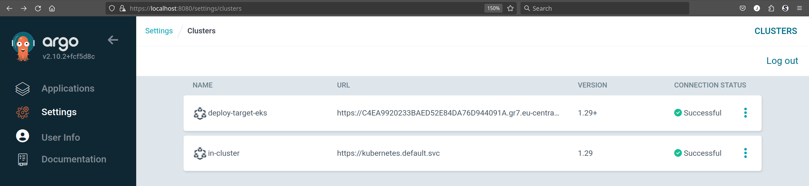


To also have the ArgoCD Cluster configuration available as Argo Application, it's enough to have the `cluster.yaml` be placed together with the `deploy-target-eks.yaml` in `infrastructure/eks` directory. The Argo Application argocd/infrastructure/aws-eks.yaml will pick it up:

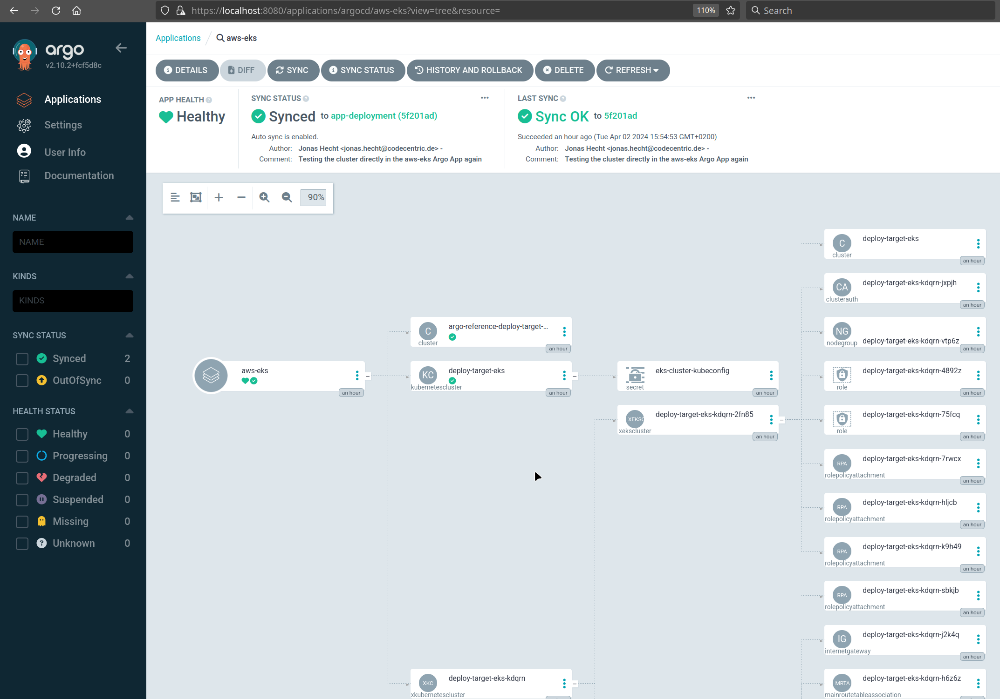

It won't be available until the EKS cluster is fully deployed, thus producing some `CannotCreateExternalResource` events:

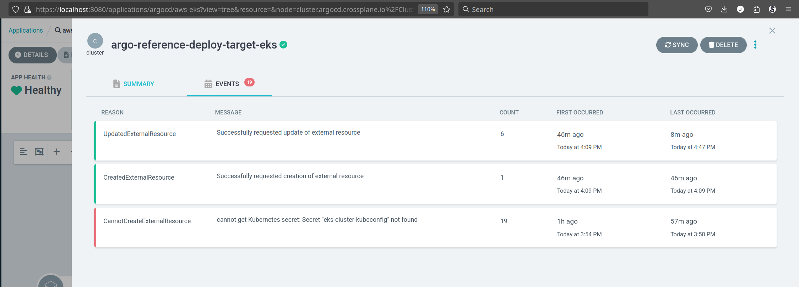


### Deploy a app to the newly added target cluster

Now we finally finally have the cluster dynamically referencable via the Crossplane ArgoCD Provider created Cluster object with the name `deploy-target-eks`! Let's try to use that in an Application deployment.

In order to deploy our example app https://github.com/jonashackt/microservice-api-spring-boot

we need the corresponding Kubernetes deployment manifests, provided by https://github.com/jonashackt/microservice-api-spring-boot-config

Having both in place, we can craft a matching ArgoCD Application:

```yaml
apiVersion: argoproj.io/v1alpha1
kind: Application
metadata:
  name: microservice-api-spring-boot
  namespace: argocd
  labels:
    crossplane.jonashackt.io: application
  finalizers:
    - resources-finalizer.argocd.argoproj.io
spec:
  project: default
  source:
    repoURL: https://github.com/jonashackt/microservice-api-spring-boot-config
    targetRevision: HEAD
    path: deployment
  destination:
    namespace: default
    server: deploy-target-eks
  syncPolicy:
    automated:
      prune: true    
    retry:
      limit: 5
      backoff:
        duration: 5s 
        factor: 2 
        maxDuration: 1m
```

As you can see we use our Cluster name `deploy-target-eks` as `spec.destination.server`.

Now let's finally deploy our app via:

```shell
kubectl apply -f argocd/applications/microservice-api-spring-boot.yaml
```


But we get the following error in Argo: 

```shell
cluster 'deploy-target-eks' has not been configured
```

Looking [into the docs](https://argo-cd.readthedocs.io/en/stable/operator-manual/declarative-setup/#applications) we get the point we're missing:

> `destination` reference to the target cluster and namespace. For the cluster one of server or name can be used, [...] Under the hood when the server is missing, it is calculated based on the name and used for any operations.

Thus we need to use `spec.destination.name` instead of `spec.destination.server`. This will then look into Argo's Cluster list and should find our `deploy-target-eks`.

Now the working manifest looks like this:

```yaml
apiVersion: argoproj.io/v1alpha1
kind: Application
metadata:
  name: microservice-api-spring-boot
  namespace: argocd
  labels:
    crossplane.jonashackt.io: application
  finalizers:
    - resources-finalizer.argocd.argoproj.io
spec:
  project: default
  source:
    repoURL: https://github.com/jonashackt/microservice-api-spring-boot-config
    targetRevision: HEAD
    path: deployment
  destination:
    namespace: default
    name: deploy-target-eks
  syncPolicy:
    automated:
      prune: true    
    retry:
      limit: 5
      backoff:
        duration: 5s 
        factor: 2 
        maxDuration: 1m
```

```shell
kubectl apply -f argocd/applications/microservice-api-spring-boot.yaml
```


If everything went fine, our App should be deployed by ArgoCD:

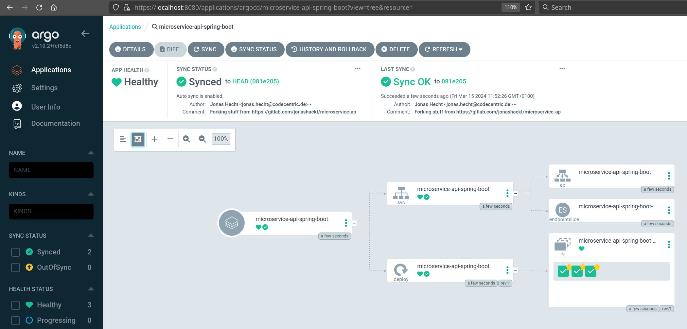


Finally a full cycle is possible - from full bootstrap of ArgoCD & Crossplane Managed cluster to target EKS cluster creation in AWS via Crossplane to configuring that one in Argo and finally deploying an App dynamically referencing this Cluster! 


# Links

https://docs.crossplane.io/knowledge-base/integrations/argo-cd-crossplane/

https://blog.upbound.io/argo-crossplane-managing-application-stack

https://docs.upbound.io/concepts/mcp/control-plane-connector/

https://blog.upbound.io/2023-09-26-product-updates

https://morningspace.medium.com/using-crossplane-in-gitops-what-to-check-in-git-76c08a5ff0c4

Infrastructure-as-Apps https://codefresh.io/blog/infrastructure-as-apps-the-gitops-future-of-infra-as-code/

https://docs.upbound.io/spaces/git-integration/

https://codefresh.io/blog/using-gitops-infrastructure-applications-crossplane-argo-cd/

Configuration drift in Tf: Terraform horror stories about incomplete/invalid state https://www.youtube.com/watch?v=ix0Tw8uinWs


BADGES :

https://argo-cd.readthedocs.io/en/stable/user-guide/status-badge/


## App of Apps and ApplicationSets

https://codefresh.io/blog/argo-cd-application-dependencies/

https://argo-cd.readthedocs.io/en/stable/operator-manual/cluster-bootstrapping/#app-of-apps-pattern

https://argo-cd.readthedocs.io/en/stable/operator-manual/applicationset/

https://github.com/argoproj/argo-cd/discussions/11892

https://github.com/christianh814/golist


## Crossplane producer of Secrets

https://docs.crossplane.io/knowledge-base/integrations/vault-as-secret-store/

> External Secret Stores are an alpha feature. They’re not recommended for production use. Crossplane disables External Secret Stores by default.

https://github.com/crossplane/crossplane/blob/master/design/design-doc-external-secret-stores.md

> storing sensitive information in external secret stores is a common practice. Since applications running on K8S need this information as well, it is also quite common to sync data from external secret stores to K8S. There are quite a few tools out there that are trying to resolve this exact same problem. **However, Crossplane, as a producer of infrastructure credentials, needs the opposite, which is storing sensitive information to external secret stores.**

--> So this feature is NOT for retrieving secrets FROM external secret providers, BUT for storing secrets IN external secret providers!

But the External Secrets Operator has also PushSecrets https://external-secrets.io/latest/api/pushsecret/ which seem to do the same
