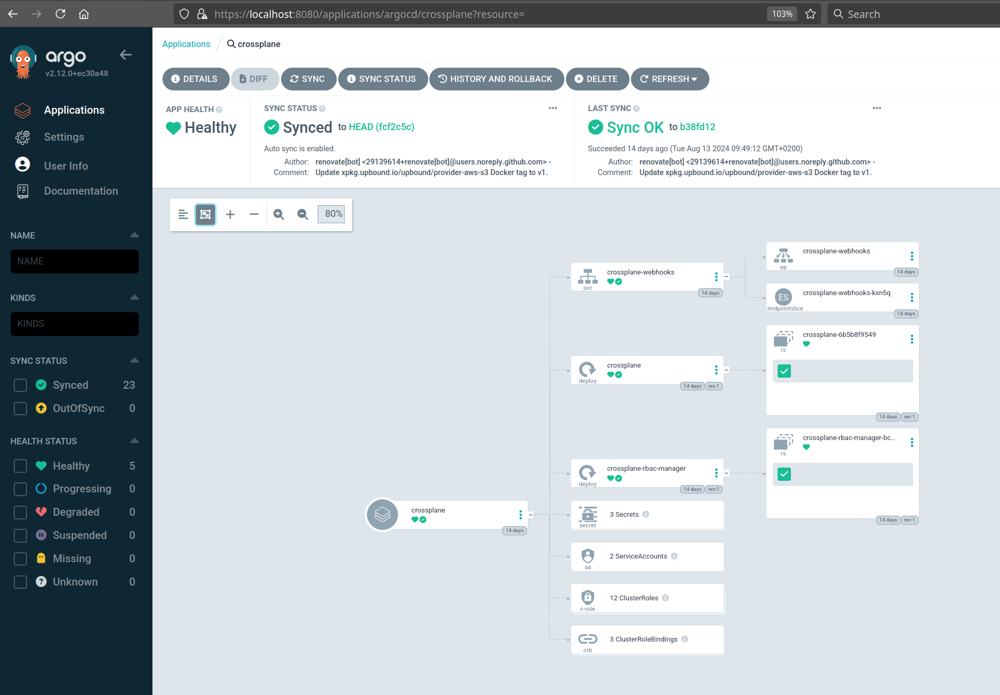

# crossplane-argocd
Example project showing how to use the crossplane together with ArgoCD

> This project is based on the crossplane only repository https://github.com/jonashackt/crossplane-aws-azure, where the basics about crossplane.io are explained in detail - incl. how to provision to AWS and Azure.

__The idea is "simple": Why not treat infrastructure deployments/provisioning the same way as appliaction deployment?!__ An ideal combination would be crossplane as control plane framework, which manages infrastructure through the Kubernetes api together with ArgoCD as [GitOps](https://www.gitops.tech/) framework to have everything in sync with our version control system.


### Prerequisites: a management cluster for ArgoCD and crossplane

First we need a simple management cluster for our ArgoCD and crossplane deployments. [As in the base project](https://github.com/jonashackt/crossplane-aws-azure) we simply use kind here:

Be sure to have some packages installed. On a Mac:

```shell
brew install kind helm kubectl kustomize argocd
```

Or on Arch/Manjaro:

```shell
pamac install kind-bin helm kubectl-bin kustomize argocd
```


https://docs.crossplane.io/latest/cli/

Also we should install the crossplane CLI

```shell
curl -sL "https://raw.githubusercontent.com/crossplane/crossplane/master/install.sh" | sh
sudo mv crossplane /usr/local/bin
```

Now the `kubectl crossplane --help` command should be ready to use.


Now spin up a local kind cluster

```shell
kind create cluster --image kindest/node:v1.29.0 --wait 5m
```


### Configure annotation based resource tracking in ArgoCD

https://docs.crossplane.io/knowledge-base/integrations/argo-cd-crossplane/

> "There are different ways to configure how Argo CD tracks resources. With Crossplane, you need to configure Argo CD to use Annotation based resource tracking."

You may already used ArgoCD with resource tracking via the well-known label `app.kubernetes.io/instance`, which is the default resource tracking mode in Argo. But from ArgoCD 2.2 on [there are additional ways of tracking resources](https://argo-cd.readthedocs.io/en/stable/user-guide/resource_tracking/#additional-tracking-methods-via-an-annotation). One of them is the annotation based resource tracking. This has some advantages:

> "The advantages of using the tracking id annotation is that there are no clashes any more with other Kubernetes tools and Argo CD is never confused about the owner of a resource. The annotation+label can also be used if you want other tools to understand resources managed by Argo CD."

The resource tracking method has to be configured inside the `argocd-cm` ConfigMap using the `application.resourceTrackingMethod` field:

```yaml
apiVersion: v1
kind: ConfigMap
metadata:
  name: argocd-cm
  labels:
    app.kubernetes.io/name: argocd-cm
    app.kubernetes.io/part-of: argocd
data:
  application.resourceTrackingMethod: annotation
```

But how do we install ArgoCD and change the ConfigMap in a flexible, GitOps-style and renovatebot-enabled way?


### Install ArgoCD into kind

There's a great repo https://github.com/jonashackt/tekton-argocd-eks where also a great way on how to configure and install ArgoCD is described https://stackoverflow.com/a/71692892/4964553 (and [also in the Argo docs](https://argo-cd.readthedocs.io/en/stable/operator-manual/declarative-setup/#manage-argo-cd-using-argo-cd)).

First we create a directory `argocd/install` and a file [`kustomization.yaml`](argocd/install/kustomization.yaml):

```yaml
apiVersion: kustomize.config.k8s.io/v1beta1
kind: Kustomization

resources:
- github.com/argoproj/argo-cd//manifests/cluster-install?ref=v2.9.3

## changes to config maps
patches:
- path: argocd-cm-patch.yml

namespace: argocd
```

We also need to create a file [`argocd-cm-patch.yml`](argocd/install/argocd-cm-patch.yml), where we can implement our needed annotation based resource tracking mode in the Argo ConfigMap:

```yaml
apiVersion: v1
kind: ConfigMap
metadata:
  name: argocd-cm
  labels:
    app.kubernetes.io/name: argocd-cm
    app.kubernetes.io/part-of: argocd
data:
  server.insecure: "true"
  application.resourceTrackingMethod: annotation
```

Creating the Argo namespace and installing it via `kubectl apply -k` is all we need to do:

```shell
kubectl create namespace argocd
kubectl apply -k argocd/install
```


__TODO:__ Configure Argo configmaps to handle Crossplane correctly

https://docs.crossplane.io/knowledge-base/integrations/argo-cd-crossplane/


### Accessing ArgoCD GUI

First we need to obtain the initial password for the `admin` user via:

```shell
kubectl -n argocd get secret argocd-initial-admin-secret -o jsonpath="{.data.password}" | base64 -d; echo
```

Now we have multiple options here - where the simplest might be a `port-forward`:

```shell
kubectl port-forward -n argocd --address='0.0.0.0' service/argocd-server 8080:80
```

Now access the ArgoCD UI inside your Browser at http://localhost:8080 using `admin` user and the obtained password.


### Login ArgoCD CLI into our argocd-server installed in kind

https://argo-cd.readthedocs.io/en/stable/getting_started/#4-login-using-the-cli

In order to be able to add applications to Argo, we should login our ArgoCD CLI into our `argocd-server` Pod installed in kind:

```shell
argocd login localhost:8080 --username admin --password $(kubectl -n argocd get secret argocd-initial-admin-secret -o jsonpath="{.data.password}" | base64 -d; echo) --insecure
```

Remember to change the initial password in production environments!


# Let ArgoCD install Crossplane

Is it possible to already use the GitOps approach right from here on to install crossplane? Let's try it.

As already used from https://github.com/jonashackt/crossplane-aws-azure and explained in https://stackoverflow.com/a/71765472/4964553 we have a simple Helm chart, which is able to be managed by RenovateBot - and thus kept up-to-date. Our Chart lives in [`crossplane/Chart.yaml`](crossplane/Chart.yaml):

```yaml
apiVersion: v2
type: application
name: crossplane-argocd
version: 0.0.0 # unused
appVersion: 0.0.0 # unused
dependencies:
  - name: crossplane
    repository: https://charts.crossplane.io/stable
    version: 1.14.5
```

__This Helm chart needs to be picked up by Argo in a declarative GitOps way (not through the UI).__

But as this is a non-standard Helm Chart, we need to define a `Secret` first [as the docs state](https://argo-cd.readthedocs.io/en/stable/operator-manual/declarative-setup/#helm-chart-repositories):

> "Non standard Helm Chart repositories have to be registered explicitly. Each repository must have url, type and name fields."

So we first create [`crossplane-helm-secret.yaml`](crossplane/crossplane-helm-secret.yaml):

```yaml
apiVersion: v1
kind: Secret
metadata:
  name: crossplane-helm-repo
  namespace: argocd
  labels:
    argocd.argoproj.io/secret-type: repository
stringData:
  name: crossplane
  url: https://charts.crossplane.io/stable
  type: helm 
```

We need to apply it via:

```shell
kubectl apply -f argocd/applications/crossplane-helm-secret.yaml
```


Now telling ArgoCD where to find our simple Crossplane Helm Chart, we use Argo's `Application` manifest in [argocd/applications/crossplane.yaml](argocd/applications/crossplane.yaml):

```yaml
# The ArgoCD Application for crossplane core components themselves
---
apiVersion: argoproj.io/v1alpha1
kind: Application
metadata:
  name: crossplane
  namespace: argocd
  finalizers:
    - resources-finalizer.argocd.argoproj.io
spec:
  project: default
  source:
    repoURL: https://github.com/jonashackt/crossplane-argocd
    targetRevision: HEAD
    path: crossplane
  destination:
    server: https://kubernetes.default.svc
    namespace: crossplane-system
  syncPolicy:
    automated:
      prune: true    
    syncOptions:
    - CreateNamespace=true
    retry:
      limit: 1
      backoff:
        duration: 5s 
        factor: 2 
        maxDuration: 1m
```

As the docs state https://argo-cd.readthedocs.io/en/stable/operator-manual/declarative-setup/#applications

> "Without the `resources-finalizer.argocd.argoproj.io finalizer`, deleting an application will not delete the resources it manages. To perform a cascading delete, you must add the finalizer. See [App Deletion](https://argo-cd.readthedocs.io/en/stable/user-guide/app_deletion/#about-the-deletion-finalizer)."

In other words, if we would run `kubectl delete -n argocd -f argocd/applications/crossplane.yaml`, Crossplane wouldn't be undeployed as we may think. Only the ArgoCD `Application` would be deleted, but Crossplane Pods etc. would be still running.

Our `Application` configures Crossplane core componentes to be automatically pruned https://argo-cd.readthedocs.io/en/stable/user-guide/auto_sync/#automatic-pruning via `automated: prune: true`.

We also use `syncOptions: - CreateNamespace=true` here [to let Argo create the crossplane `crossplane-system` namespace for us automatically](https://argo-cd.readthedocs.io/en/stable/user-guide/sync-options/#create-namespace).


```shell
kubectl apply -n argocd -f argocd/applications/crossplane.yaml
```

Now ArgoCD deploys our core crossplane components for us :)

Just have a look into Argo UI:



We can double check everything is there on the command line via:

```shell
kubectl get all -n crossplane-system
```


### Create aws-creds.conf file & create AWS Provider secret

https://docs.crossplane.io/latest/getting-started/provider-aws/#generate-an-aws-key-pair-file

I assume here that you have [aws CLI installed and configured](https://docs.aws.amazon.com/cli/latest/userguide/getting-started-install.html). So that the command `aws configure` should work on your system. With this prepared we can create an `aws-creds.conf` file:

```shell
echo "[default]
aws_access_key_id = $(aws configure get aws_access_key_id)
aws_secret_access_key = $(aws configure get aws_secret_access_key)
" > aws-creds.conf
```

> Don't ever check this file into source control - it holds your AWS credentials! For this repository I added `*-creds.conf` to the [.gitignore](.gitignore) file. 


Now we need to use the `aws-creds.conf` file to create the Crossplane AWS Provider secret:

```shell
kubectl create secret generic aws-creds -n crossplane-system --from-file=creds=./aws-creds.conf
```

__TODO:__ create Secret as via manifest (in GitHub Actions)?!


### Install crossplane's AWS provider with ArgoCD

Our crossplane AWS provider reside in [upbound/provider-aws-s3/config/provider-aws-s3.yaml](upbound/provider-aws-s3/config/provider-aws-s3.yaml):

```yaml
apiVersion: pkg.crossplane.io/v1
kind: Provider
metadata:
  name: provider-aws-s3
spec:
  package: xpkg.upbound.io/upbound/provider-aws-s3:v0.46.0
  packagePullPolicy: Always
  revisionActivationPolicy: Automatic
  revisionHistoryLimit: 1
```

How do we let ArgoCD manage and deploy this to our cluster? The simple way of [defining a directory containing k8s manifests](https://argo-cd.readthedocs.io/en/stable/user-guide/directory/) is what we're looking for. Therefore we create a new ArgoCD `Application` CRD at [argocd/applications/crossplane-provider-aws.yaml](argocd/applications/crossplane-provider-aws.yaml), which tells Argo to look in the directory path `upbound/provider-aws-s3/config`:

```yaml
apiVersion: argoproj.io/v1alpha1
kind: Application
metadata:
  name: provider-aws-s3
  namespace: argocd
  finalizers:
    - resources-finalizer.argocd.argoproj.io
spec:
  project: default
  source:
    path: upbound/provider-aws-s3/config
    repoURL: https://github.com/jonashackt/crossplane-argocd
    targetRevision: HEAD
  destination:
    namespace: default
    server: https://kubernetes.default.svc
  # Using syncPolicy.automated here, otherwise the deployement of our Crossplane provider will fail with
  # 'Resource not found in cluster: pkg.crossplane.io/v1/Provider:provider-aws-s3'
  syncPolicy:
    automated: 
      prune: true     
```

The crucial point here is to use the `syncPolicy.automated` flag as described in the docs: https://argo-cd.readthedocs.io/en/stable/user-guide/auto_sync/. Otherwise the deployment of the Crossplane `provider-aws-s3` will give the following error:

```shell
Resource not found in cluster: pkg.crossplane.io/v1/Provider:provider-aws-s3
```

The automated syncPolicy makes sure that child apps are automatically created, synced, and deleted when the manifest is changed.

> This flag enables ArgoCD's "true" GitOps feature, where the CI/CD pipeline doesn't deploy themselfes (Push-based GitOps) but only makes a git commit. Then the GitOps operator inside the Kubernetes cluster (here ArgoCD) recognizes the change in the Git repository and deploys the changes to match the state of the repository in the cluster.

We also use the finalizer `resources-finalizer.argocd.argoproj.io finalizer` like we did with the Crossplane core components so that a `kubectl delete -f` would also undeploy all components of our Provider `provider-aws-s3`.

Let's apply this `Application` to our cluster also:

```shell
kubectl apply -n argocd -f argocd/applications/crossplane-provider-aws.yaml 
```


We run into the following error while syncing in Argo:

```shell
The Kubernetes API could not find aws.upbound.io/ProviderConfig for requested resource default/default. Make sure the "ProviderConfig" CRD is installed on the destination cluster.
```


### Install crossplane's AWS provider ProviderConfig with ArgoCD

To get our Provider finally working we also need to create a `ProviderConfig` accordingly that will tell the Provider where to find it's AWS credentials. Therefore we create a [upbound/provider-aws-s3/config/provider-config-aws.yaml](upbound/provider-aws-s3/config/provider-config-aws.yaml):

```yaml
apiVersion: aws.upbound.io/v1beta1
kind: ProviderConfig
metadata:
  name: default
spec:
  credentials:
    source: Secret
    secretRef:
      namespace: crossplane-system
      name: aws-creds
      key: creds
```

> Crossplane resources use the `ProviderConfig` named `default` if no specific ProviderConfig is specified, so this ProviderConfig will be the default for all AWS resources.

The `secretRef.name` and `secretRef.key` has to match the fields of the already created Secret.


To let ArgoCD manage and deploy our `ProviderConfig` we again create a new ArgoCD `Application` CRD at [argocd/applications/crossplane-provider-config-aws.yaml](argocd/applications/crossplane-provider-config-aws.yaml) [defining a directory containing k8s manifests](https://argo-cd.readthedocs.io/en/stable/user-guide/directory/), which tells Argo to look in the directory path `upbound/provider-aws-s3/config`:


```yaml
apiVersion: argoproj.io/v1alpha1
kind: Application
metadata:
  name: provider-config-aws
  namespace: argocd
  finalizers:
    - resources-finalizer.argocd.argoproj.io
spec:
  project: default
  source:
    path: upbound/provider-aws-s3/config
    repoURL: https://github.com/jonashackt/crossplane-argocd
    targetRevision: HEAD
  destination:
    namespace: default
    server: https://kubernetes.default.svc
  # Using syncPolicy.automated here, otherwise the deployement of our Crossplane provider will fail with
  # 'Resource not found in cluster: pkg.crossplane.io/v1/Provider:provider-aws-s3'
  syncPolicy:
    automated: 
      prune: true    
```


```shell
kubectl apply -n argocd -f argocd/applications/crossplane-provider-config-aws.yaml 
```


We finally managed to let Argo deploy the Crossplane core components together with the AWS Provider and ProviderConfig correctly:


# Using ArgoCD's AppOfApps pattern to deploy Crossplane components

### Why our current setup is sub optimal

While our setup works now and also fully implements the GitOps way, we have a lot of `Application` files, that need to be applied in a specific order. Furthermore the `Provider` and `ProviderConfig` manifests (which simply configure the AWS Crossplane Provider) need to reside in different directories - `upbound/provider-aws-s3/provider` and `upbound/provider-aws-s3/config`. 

> __Our goal should be a single manifest defining the whole Crossplane setup incl. core, Provider, ProviderConfig etc. in ArgoCD__

If we would use [an Application that points to a directory](https://argo-cd.readthedocs.io/en/stable/user-guide/directory/) with multiple manifests, we'll run into errors like this:

```shell
The Kubernetes API could not find aws.upbound.io/ProviderConfig for requested resource default/default. Make sure the "ProviderConfig" CRD is installed on the destination cluster.
```

Since deployment order wouldn't be clear and the `Provider` manifests need to be fully deployed before the `ProviderConfig` - otherwise the deployment fails because of missing CRDs. 

__Wouldn't be Argo's SyncWaves feature a great match for that issue?__

> The ArgoCD docs have a great video explaining SyncWaves and Hooks: https://www.youtube.com/watch?v=zIHe3EVp528

> Another great SyncWave tutorial can be found here https://redhat-scholars.github.io/argocd-tutorial/argocd-tutorial/04-syncwaves-hooks.html

Sadly using Argo's [`SyncWaves` feature](https://argo-cd.readthedocs.io/en/stable/user-guide/sync-waves/) alone doesn't really help here, if we use them at the `Application` level. I had a hard time figuring that one out, but to really use the SyncWaves feature, we would need to use the annotations like `metadata: annotations: argocd.argoproj.io/sync-wave: "2"` on every of the Crossplane Provider's Kubernetes objects (and thus alter the manifests to add the annotation).


### App of Apps Pattern vs. ApplicationSets

Now there are multiple patterns you can use to manage multiple ArgoCD application. You can for example go with [the App of Apps Pattern](https://argo-cd.readthedocs.io/en/stable/operator-manual/cluster-bootstrapping/#app-of-apps-pattern) or with [`ApplicationSets`](https://argo-cd.readthedocs.io/en/stable/operator-manual/applicationset/), which moved into the ArgoCD main project around version 2.6.

You'd might say: ApplicationSets is the way to go today. But __App of Apps is not deprecated__ https://github.com/argoproj/argo-cd/discussions/11892#discussioncomment-6765089 The exact same GitHub issue shows our discussion. From it I would extract the following TLDR: If you want to bootstrap a cluster (e.g. installing tools like Crossplane), the App of Apps feature together with it's support for SyncWaves is pretty handsome. That might be the reason, the feature is described inside the `operator-manual/cluster-bootstrapping` part of the docs: https://argo-cd.readthedocs.io/en/stable/operator-manual/cluster-bootstrapping/#app-of-apps-pattern

If you want to get your teams enabled to deploy their apps in a GitOps fashion (incl. self-service) and want a great way to use multiple manifests in apps also from within monorepos (e.g. backend, frontend, db), then [the `ApplicationSet` feature](https://argo-cd.readthedocs.io/en/stable/operator-manual/applicationset/) is match for you. It also generates the `Application` manifests automatically leveraging it's many generators, like `Git Generator: Directories`, `Git Generator: Files` and so on. My colleague Daniel Häcker [wrote a great post about that topic](https://www.codecentric.de/wissens-hub/blog/gitops-argocd). 

As we're focussing on bootstrapping our cluster with ArgoCD and Crossplane, let's go with the App of Apps Pattern here.


### Implementing the App of Apps Pattern for Crossplane deployment

ArgoCD Applications can be used in ArgoCD Applications - since they are normal Kubernetes CRDs. 

Therefore let's define a new top level `Application` that manages the whole Crossplane setup incl. core, Provider, ProviderConfig etc.

I created my App of Apps definition in [argocd/crossplane-app-of-apps.yaml](argocd/crossplane-app-of-apps.yaml):

```yaml
# The ArgoCD App of Apps for all Crossplane components
---
apiVersion: argoproj.io/v1alpha1
kind: Application
metadata:
  name: crossplane-all
  namespace: argocd
spec:
  project: default
  source:
    path: argocd/applications
    repoURL: https://github.com/jonashackt/crossplane-argocd
    targetRevision: HEAD
  destination:
    server: https://kubernetes.default.svc
    namespace: crossplane-system
  syncPolicy:
    automated:
      prune: true    
    syncOptions:
    - CreateNamespace=true
    retry:
      limit: 1
      backoff:
        duration: 5s 
        factor: 2 
        maxDuration: 1m
```

This `Application` will look for manifests at `argocd/applications` in our repository https://github.com/jonashackt/crossplane-argocd. And there all our Crossplane components are already defined as ArgoCD `Application` manifests. 

Voilá. Now we need to use Argo's [`SyncWaves` feature](https://argo-cd.readthedocs.io/en/stable/user-guide/sync-waves/) as already mentioned to define, which ArgoCD Application (representing a Crossplane component each) needs to be deployed by Argo in which exact order.

First we need to deploy the [Crossplane Helm Secret](argocd/applications/crossplane-helm-secret.yaml), so we add the `annotations: argocd.argoproj.io/sync-wave` configuration to it's `metadata`:

```yaml
metadata:
  annotations:
    argocd.argoproj.io/sync-wave: "0"
```

We use `sync-wave: "0"` here, to define it as the earliest stage of Argo deployment (you could use negative numbers though, but for simplicity we start at zero).

Then we need to deploy the Crossplane core components, defined in [`argocd/applications/crossplane.yaml`](argocd/applications/crossplane.yaml). There we add the next SyncWave as `sync-wave: "1"`:

```yaml
metadata:
  annotations:
    argocd.argoproj.io/sync-wave: "1"
```

You get the point! We also add the `sync-wave` annotation to the AWS Provider in [`argocd/applications/crossplane-provider-aws.yaml`](argocd/applications/crossplane-provider-aws.yaml) and the ProviderConfig at [`argocd/applications/crossplane-provider-config-aws.yaml`](argocd/applications/crossplane-provider-config-aws.yaml).

Now we should be able to finally apply our Crossplane App of Apps in Argo:

```shell
kubectl apply -n argocd -f argocd/crossplane-app-of-apps.yaml 
```


# Links

https://docs.crossplane.io/knowledge-base/integrations/argo-cd-crossplane/

https://blog.upbound.io/argo-crossplane-managing-application-stack

https://docs.upbound.io/concepts/mcp/control-plane-connector/

https://blog.upbound.io/2023-09-26-product-updates

https://morningspace.medium.com/using-crossplane-in-gitops-what-to-check-in-git-76c08a5ff0c4

Infrastructure-as-Apps https://codefresh.io/blog/infrastructure-as-apps-the-gitops-future-of-infra-as-code/

https://docs.upbound.io/spaces/git-integration/

https://codefresh.io/blog/using-gitops-infrastructure-applications-crossplane-argo-cd/

Configuration drift in Tf: Terraform horror stories about incomplete/invalid state https://www.youtube.com/watch?v=ix0Tw8uinWs


BADGES :

https://argo-cd.readthedocs.io/en/stable/user-guide/status-badge/


## App of Apps and ApplicationSets

https://codefresh.io/blog/argo-cd-application-dependencies/

https://argo-cd.readthedocs.io/en/stable/operator-manual/cluster-bootstrapping/#app-of-apps-pattern

https://argo-cd.readthedocs.io/en/stable/operator-manual/applicationset/

https://github.com/argoproj/argo-cd/discussions/11892