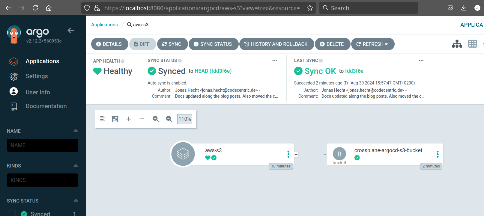

# crossplane-argocd
[](https://github.com/jonashackt/crossplane-argocd/actions/workflows/crossplane-argocd.yml)
[](https://github.com/jonashackt/crossplane-argocd/actions/workflows/crossplane-argocd-external-secrets.yml)
[](https://github.com/jonashackt/crossplane-argocd/blob/master/LICENSE)
[](https://renovatebot.com)

Example project showing how to use the crossplane together with ArgoCD

> This project is based on the crossplane only repository https://github.com/jonashackt/crossplane-aws-azure, where the basics about crossplane.io are explained in detail - incl. how to provision to AWS and Azure.

__The idea is "simple": Why not treat infrastructure deployments/provisioning the same way as application deployment?!__ An ideal combination would be crossplane as control plane framework, which manages infrastructure through the Kubernetes api together with ArgoCD as [GitOps](https://www.gitops.tech/) framework to have everything in sync with our version control system.


### Prerequisites: a management cluster for ArgoCD and crossplane

First we need a simple management cluster for our ArgoCD and crossplane deployments. [As in the base project](https://github.com/jonashackt/crossplane-aws-azure) we simply use kind here:

Be sure to have some packages installed. On a Mac:

```shell
brew install kind helm kubectl kustomize argocd
```

Or on Arch/Manjaro:

```shell
pamac install kind-bin helm kubectl-bin kustomize argocd
```


https://docs.crossplane.io/latest/cli/

Also we should install the crossplane CLI

```shell
curl -sL "https://raw.githubusercontent.com/crossplane/crossplane/master/install.sh" | sh
sudo mv crossplane /usr/local/bin
```

Now the `kubectl crossplane --help` command should be ready to use.


Now spin up a local kind cluster

```shell
kind create cluster --image kindest/node:v1.29.0 --wait 5m
```


### Configure annotation based resource tracking in ArgoCD

https://docs.crossplane.io/knowledge-base/integrations/argo-cd-crossplane/

> "There are different ways to configure how Argo CD tracks resources. With Crossplane, you need to configure Argo CD to use Annotation based resource tracking."

You may already used ArgoCD with resource tracking via the well-known label `app.kubernetes.io/instance`, which is the default resource tracking mode in Argo. But from ArgoCD 2.2 on [there are additional ways of tracking resources](https://argo-cd.readthedocs.io/en/stable/user-guide/resource_tracking/#additional-tracking-methods-via-an-annotation). One of them is the annotation based resource tracking. This has some advantages:

> "The advantages of using the tracking id annotation is that there are no clashes any more with other Kubernetes tools and Argo CD is never confused about the owner of a resource. The annotation+label can also be used if you want other tools to understand resources managed by Argo CD."

The resource tracking method has to be configured inside the `argocd-cm` ConfigMap using the `application.resourceTrackingMethod` field:

```yaml
apiVersion: v1
kind: ConfigMap
metadata:
  name: argocd-cm
  labels:
    app.kubernetes.io/name: argocd-cm
    app.kubernetes.io/part-of: argocd
data:
  application.resourceTrackingMethod: annotation
```

But how do we install ArgoCD and change the ConfigMap in a flexible, GitOps-style and renovatebot-enabled way?


### Install ArgoCD into kind

There's a great repo https://github.com/jonashackt/tekton-argocd-eks where also a great way on how to configure and install ArgoCD is described https://stackoverflow.com/a/71692892/4964553 (and [also in the Argo docs](https://argo-cd.readthedocs.io/en/stable/operator-manual/declarative-setup/#manage-argo-cd-using-argo-cd)).

First we create a directory `argocd/install` and a file [`kustomization.yaml`](argocd/install/kustomization.yaml):

```yaml
apiVersion: kustomize.config.k8s.io/v1beta1
kind: Kustomization

resources:
- github.com/argoproj/argo-cd//manifests/cluster-install?ref=v2.9.3

## changes to config maps
patches:
- path: argocd-cm-patch.yml

namespace: argocd
```

We also need to create a file [`argocd-cm-patch.yml`](argocd/install/argocd-cm-patch.yml), where we can implement our needed annotation based resource tracking mode in the Argo ConfigMap:

```yaml
apiVersion: v1
kind: ConfigMap
metadata:
  name: argocd-cm
  labels:
    app.kubernetes.io/name: argocd-cm
    app.kubernetes.io/part-of: argocd
data:
  server.insecure: "true"
  application.resourceTrackingMethod: annotation
```

Creating the Argo namespace and installing it via `kubectl apply -k` is all we need to do:

```shell
kubectl create namespace argocd
kubectl apply -k argocd/install
```


__TODO:__ Configure Argo configmaps to handle Crossplane correctly

https://docs.crossplane.io/knowledge-base/integrations/argo-cd-crossplane/


### Accessing ArgoCD GUI

First we need to obtain the initial password for the `admin` user via:

```shell
kubectl -n argocd get secret argocd-initial-admin-secret -o jsonpath="{.data.password}" | base64 -d; echo
```

Now we have multiple options here - where the simplest might be a `port-forward`:

```shell
kubectl port-forward -n argocd --address='0.0.0.0' service/argocd-server 8080:80
```

Now access the ArgoCD UI inside your Browser at http://localhost:8080 using `admin` user and the obtained password.


### Login ArgoCD CLI into our argocd-server installed in kind

https://argo-cd.readthedocs.io/en/stable/getting_started/#4-login-using-the-cli

In order to be able to add applications to Argo, we should login our ArgoCD CLI into our `argocd-server` Pod installed in kind:

```shell
argocd login localhost:8080 --username admin --password $(kubectl -n argocd get secret argocd-initial-admin-secret -o jsonpath="{.data.password}" | base64 -d; echo) --insecure
```

Remember to change the initial password in production environments!


# Let ArgoCD install Crossplane

Is it possible to already use the GitOps approach right from here on to install crossplane? Let's try it.

As already used from https://github.com/jonashackt/crossplane-aws-azure and explained in https://stackoverflow.com/a/71765472/4964553 we have a simple Helm chart, which is able to be managed by RenovateBot - and thus kept up-to-date. Our Chart lives in [`crossplane/Chart.yaml`](crossplane/Chart.yaml):

```yaml
apiVersion: v2
type: application
name: crossplane-argocd
version: 0.0.0 # unused
appVersion: 0.0.0 # unused
dependencies:
  - name: crossplane
    repository: https://charts.crossplane.io/stable
    version: 1.14.5
```

__This Helm chart needs to be picked up by Argo in a declarative GitOps way (not through the UI).__

But as this is a non-standard Helm Chart, we need to define a `Secret` first [as the docs state](https://argo-cd.readthedocs.io/en/stable/operator-manual/declarative-setup/#helm-chart-repositories):

> "Non standard Helm Chart repositories have to be registered explicitly. Each repository must have url, type and name fields."

So we first create [`crossplane-helm-secret.yaml`](argocd/crossplane-bootstrap/crossplane-helm-secret.yaml):

```yaml
apiVersion: v1
kind: Secret
metadata:
  name: crossplane-helm-repo
  namespace: argocd
  labels:
    argocd.argoproj.io/secret-type: repository
stringData:
  name: crossplane
  url: https://charts.crossplane.io/stable
  type: helm 
```

We need to apply it via:

```shell
kubectl apply -f argocd/crossplane-bootstrap/crossplane-helm-secret.yaml
```


Now telling ArgoCD where to find our simple Crossplane Helm Chart, we use Argo's `Application` manifest in [argocd/crossplane-bootstrap/crossplane.yaml](argocd/crossplane-bootstrap/crossplane.yaml):

```yaml
# The ArgoCD Application for crossplane core components themselves
---
apiVersion: argoproj.io/v1alpha1
kind: Application
metadata:
  name: crossplane
  namespace: argocd
  finalizers:
    - resources-finalizer.argocd.argoproj.io
spec:
  project: default
  source:
    repoURL: https://github.com/jonashackt/crossplane-argocd
    targetRevision: HEAD
    path: crossplane
  destination:
    server: https://kubernetes.default.svc
    namespace: crossplane-system
  syncPolicy:
    automated:
      prune: true    
    syncOptions:
    - CreateNamespace=true
    retry:
      limit: 1
      backoff:
        duration: 5s 
        factor: 2 
        maxDuration: 1m
```

As the docs state https://argo-cd.readthedocs.io/en/stable/operator-manual/declarative-setup/#crossplane-bootstrap

> "Without the `resources-finalizer.argocd.argoproj.io finalizer`, deleting an application will not delete the resources it manages. To perform a cascading delete, you must add the finalizer. See [App Deletion](https://argo-cd.readthedocs.io/en/stable/user-guide/app_deletion/#about-the-deletion-finalizer)."

In other words, if we would run `kubectl delete -n argocd -f argocd/crossplane-bootstrap/crossplane.yaml`, Crossplane wouldn't be undeployed as we may think. Only the ArgoCD `Application` would be deleted, but Crossplane Pods etc. would be still running.

Our `Application` configures Crossplane core componentes to be automatically pruned https://argo-cd.readthedocs.io/en/stable/user-guide/auto_sync/#automatic-pruning via `automated: prune: true`.

We also use `syncOptions: - CreateNamespace=true` here [to let Argo create the crossplane `crossplane-system` namespace for us automatically](https://argo-cd.readthedocs.io/en/stable/user-guide/sync-options/#create-namespace).


```shell
kubectl apply -n argocd -f argocd/crossplane-bootstrap/crossplane.yaml
```

Now ArgoCD deploys our core crossplane components for us :)

Just have a look into Argo UI:


We can double check everything is there on the command line via:

```shell
kubectl get all -n crossplane-system
```
                               

### Create aws-creds.conf file & create AWS Provider secret

https://docs.crossplane.io/latest/getting-started/provider-aws/#generate-an-aws-key-pair-file

I assume here that you have [aws CLI installed and configured](https://docs.aws.amazon.com/cli/latest/userguide/getting-started-install.html). So that the command `aws configure` should work on your system. With this prepared we can create an `aws-creds.conf` file:

```shell
echo "[default]
aws_access_key_id = $(aws configure get aws_access_key_id)
aws_secret_access_key = $(aws configure get aws_secret_access_key)
" > aws-creds.conf
```

> Don't ever check this file into source control - it holds your AWS credentials! For this repository I added `*-creds.conf` to the [.gitignore](.gitignore) file. 


Now we need to use the `aws-creds.conf` file to create the Crossplane AWS Provider secret:

```shell
kubectl create secret generic aws-creds -n crossplane-system --from-file=creds=./aws-creds.conf
```

__TODO:__ create Secret as via manifest (in GitHub Actions)?!


### Install crossplane's AWS provider with ArgoCD

Our crossplane AWS provider reside in [upbound/provider-aws-s3/config/provider-aws-s3.yaml](upbound/provider-aws-s3/config/provider-aws-s3.yaml):

```yaml
apiVersion: pkg.crossplane.io/v1
kind: Provider
metadata:
  name: provider-aws-s3
spec:
  package: xpkg.upbound.io/upbound/provider-aws-s3:v0.46.0
  packagePullPolicy: Always
  revisionActivationPolicy: Automatic
  revisionHistoryLimit: 1
```

How do we let ArgoCD manage and deploy this to our cluster? The simple way of [defining a directory containing k8s manifests](https://argo-cd.readthedocs.io/en/stable/user-guide/directory/) is what we're looking for. Therefore we create a new ArgoCD `Application` CRD at [argocd/crossplane-bootstrap/crossplane-provider-aws.yaml](argocd/crossplane-bootstrap/crossplane-provider-aws.yaml), which tells Argo to look in the directory path `upbound/provider-aws-s3/config`:

```yaml
apiVersion: argoproj.io/v1alpha1
kind: Application
metadata:
  name: provider-aws-s3
  namespace: argocd
  finalizers:
    - resources-finalizer.argocd.argoproj.io
spec:
  project: default
  source:
    path: upbound/provider-aws-s3/config
    repoURL: https://github.com/jonashackt/crossplane-argocd
    targetRevision: HEAD
  destination:
    namespace: default
    server: https://kubernetes.default.svc
  # Using syncPolicy.automated here, otherwise the deployement of our Crossplane provider will fail with
  # 'Resource not found in cluster: pkg.crossplane.io/v1/Provider:provider-aws-s3'
  syncPolicy:
    automated: 
      prune: true     
```

The crucial point here is to use the `syncPolicy.automated` flag as described in the docs: https://argo-cd.readthedocs.io/en/stable/user-guide/auto_sync/. Otherwise the deployment of the Crossplane `provider-aws-s3` will give the following error:

```shell
Resource not found in cluster: pkg.crossplane.io/v1/Provider:provider-aws-s3
```

The automated syncPolicy makes sure that child apps are automatically created, synced, and deleted when the manifest is changed.

> This flag enables ArgoCD's "true" GitOps feature, where the CI/CD pipeline doesn't deploy themselfes (Push-based GitOps) but only makes a git commit. Then the GitOps operator inside the Kubernetes cluster (here ArgoCD) recognizes the change in the Git repository and deploys the changes to match the state of the repository in the cluster.

We also use the finalizer `resources-finalizer.argocd.argoproj.io finalizer` like we did with the Crossplane core components so that a `kubectl delete -f` would also undeploy all components of our Provider `provider-aws-s3`.

Let's apply this `Application` to our cluster also:

```shell
kubectl apply -n argocd -f argocd/crossplane-bootstrap/crossplane-provider-aws.yaml 
```


We run into the following error while syncing in Argo:

```shell
The Kubernetes API could not find aws.upbound.io/ProviderConfig for requested resource default/default. Make sure the "ProviderConfig" CRD is installed on the destination cluster.
```


### Install crossplane's AWS provider ProviderConfig with ArgoCD

To get our Provider finally working we also need to create a `ProviderConfig` accordingly that will tell the Provider where to find it's AWS credentials. Therefore we create a [upbound/provider-aws-s3/config/provider-aws-config.yaml](upbound/provider-aws-s3/config/provider-aws-config.yaml):

```yaml
apiVersion: aws.upbound.io/v1beta1
kind: ProviderConfig
metadata:
  name: default
spec:
  credentials:
    source: Secret
    secretRef:
      namespace: crossplane-system
      name: aws-creds
      key: creds
```

> Crossplane resources use the `ProviderConfig` named `default` if no specific ProviderConfig is specified, so this ProviderConfig will be the default for all AWS resources.

The `secretRef.name` and `secretRef.key` has to match the fields of the already created Secret.


To let ArgoCD manage and deploy our `ProviderConfig` we again create a new ArgoCD `Application` CRD at [argocd/crossplane-bootstrap/crossplane-provider-aws-config.yaml](argocd/crossplane-bootstrap/crossplane-provider-aws-config.yaml) [defining a directory containing k8s manifests](https://argo-cd.readthedocs.io/en/stable/user-guide/directory/), which tells Argo to look in the directory path `upbound/provider-aws-s3/config`:


```yaml
apiVersion: argoproj.io/v1alpha1
kind: Application
metadata:
  name: provider-aws-config
  namespace: argocd
  finalizers:
    - resources-finalizer.argocd.argoproj.io
spec:
  project: default
  source:
    path: upbound/provider-aws-s3/config
    repoURL: https://github.com/jonashackt/crossplane-argocd
    targetRevision: HEAD
  destination:
    namespace: default
    server: https://kubernetes.default.svc
  # Using syncPolicy.automated here, otherwise the deployement of our Crossplane provider will fail with
  # 'Resource not found in cluster: pkg.crossplane.io/v1/Provider:provider-aws-s3'
  syncPolicy:
    automated: 
      prune: true    
```


```shell
kubectl apply -n argocd -f argocd/crossplane-bootstrap/crossplane-provider-aws-config.yaml 
```


We finally managed to let Argo deploy the Crossplane core components together with the AWS Provider and ProviderConfig correctly:


# Using ArgoCD's AppOfApps pattern to deploy Crossplane components

### Why our current setup is sub optimal

While our setup works now and also fully implements the GitOps way, we have a lot of `Application` files, that need to be applied in a specific order. Furthermore the `Provider` and `ProviderConfig` manifests (which simply configure the AWS Crossplane Provider) need to reside in different directories - `upbound/provider-aws-s3/provider` and `upbound/provider-aws-s3/config`. 

> __Our goal should be a single manifest defining the whole Crossplane setup incl. core, Provider, ProviderConfig etc. in ArgoCD__

If we would use [an Application that points to a directory](https://argo-cd.readthedocs.io/en/stable/user-guide/directory/) with multiple manifests, we'll run into errors like this:

```shell
The Kubernetes API could not find aws.upbound.io/ProviderConfig for requested resource default/default. Make sure the "ProviderConfig" CRD is installed on the destination cluster.
```

Since deployment order wouldn't be clear and the `Provider` manifests need to be fully deployed before the `ProviderConfig` - otherwise the deployment fails because of missing CRDs. 

__Wouldn't be Argo's SyncWaves feature a great match for that issue?__

> The ArgoCD docs have a great video explaining SyncWaves and Hooks: https://www.youtube.com/watch?v=zIHe3EVp528

> Another great SyncWave tutorial can be found here https://redhat-scholars.github.io/argocd-tutorial/argocd-tutorial/04-syncwaves-hooks.html

Sadly using Argo's [`SyncWaves` feature](https://argo-cd.readthedocs.io/en/stable/user-guide/sync-waves/) alone doesn't really help here, if we use them at the `Application` level. I had a hard time figuring that one out, but to really use the SyncWaves feature, we would need to use the annotations like `metadata: annotations: argocd.argoproj.io/sync-wave: "2"` on every of the Crossplane Provider's Kubernetes objects (and thus alter the manifests to add the annotation).


### App of Apps Pattern vs. ApplicationSets

Now there are multiple patterns you can use to manage multiple ArgoCD application. You can for example go with [the App of Apps Pattern](https://argo-cd.readthedocs.io/en/stable/operator-manual/cluster-bootstrapping/#app-of-apps-pattern) or with [`ApplicationSets`](https://argo-cd.readthedocs.io/en/stable/operator-manual/applicationset/), which moved into the ArgoCD main project around version 2.6.

You'd might say: ApplicationSets is the way to go today. But __App of Apps is not deprecated__ https://github.com/argoproj/argo-cd/discussions/11892#discussioncomment-6765089 The exact same GitHub issue shows our discussion. From it I would extract the following TLDR: If you want to bootstrap a cluster (e.g. installing tools like Crossplane), the App of Apps feature together with it's support for SyncWaves is pretty handsome. That might be the reason, the feature is described inside the `operator-manual/cluster-bootstrapping` part of the docs: https://argo-cd.readthedocs.io/en/stable/operator-manual/cluster-bootstrapping/#app-of-apps-pattern

If you want to get your teams enabled to deploy their apps in a GitOps fashion (incl. self-service) and want a great way to use multiple manifests in apps also from within monorepos (e.g. backend, frontend, db), then [the `ApplicationSet` feature](https://argo-cd.readthedocs.io/en/stable/operator-manual/applicationset/) is match for you. It also generates the `Application` manifests automatically leveraging it's many generators, like `Git Generator: Directories`, `Git Generator: Files` and so on. My colleague Daniel Häcker [wrote a great post about that topic](https://www.codecentric.de/wissens-hub/blog/gitops-argocd). 

As we're focussing on bootstrapping our cluster with ArgoCD and Crossplane, let's go with the App of Apps Pattern here.


### Implementing the App of Apps Pattern for Crossplane deployment

ArgoCD Applications can be used in ArgoCD Applications - since they are normal Kubernetes CRDs. 

Therefore let's define a new top level `Application` that manages the whole Crossplane setup incl. core, Provider, ProviderConfig etc.

I created my App of Apps definition in [argocd/crossplane-bootstrap.yaml](argocd/crossplane-bootstrap.yaml):

```yaml
# The ArgoCD App of Apps for all Crossplane components
---
apiVersion: argoproj.io/v1alpha1
kind: Application
metadata:
  name: crossplane
  namespace: argocd
  finalizers:
    - resources-finalizer.argocd.argoproj.io
spec:
  project: default
  source:
    repoURL: https://github.com/jonashackt/crossplane-argocd
    targetRevision: HEAD
    path: argocd/crossplane-bootstrap
  destination:
    server: https://kubernetes.default.svc
    namespace: crossplane-system
  syncPolicy:
    automated:
      prune: true    
    syncOptions:
    - CreateNamespace=true
    retry:
      limit: 1
      backoff:
        duration: 5s 
        factor: 2 
        maxDuration: 1m
```

This `Application` will look for manifests at `argocd/crossplane-bootstrap` in our repository https://github.com/jonashackt/crossplane-argocd. And there all our Crossplane components are already defined as ArgoCD `Application` manifests. 

Also don't forget to define the finalizers `finalizers: - resources-finalizer.argocd.argoproj.io`. Otherwise the Applications managed by this App of Apps won't be deleted and will still be running, if you delete just the App of Apps!

Voilá. Now we need to use Argo's [`SyncWaves` feature](https://argo-cd.readthedocs.io/en/stable/user-guide/sync-waves/) as already mentioned to define, which ArgoCD Application (representing a Crossplane component each) needs to be deployed by Argo in which exact order.

First we need to deploy the [Crossplane Helm Secret](argocd/crossplane-bootstrap/crossplane-helm-secret.yaml), so we add the `annotations: argocd.argoproj.io/sync-wave` configuration to it's `metadata`:

```yaml
metadata:
  annotations:
    argocd.argoproj.io/sync-wave: "0"
```

We use `sync-wave: "0"` here, to define it as the earliest stage of Argo deployment (you could use negative numbers though, but for simplicity we start at zero).

Then we need to deploy the Crossplane core components, defined in [`argocd/crossplane-bootstrap/crossplane.yaml`](argocd/crossplane-bootstrap/crossplane.yaml). There we add the next SyncWave as `sync-wave: "1"`:

```yaml
metadata:
  annotations:
    argocd.argoproj.io/sync-wave: "1"
```

You get the point! We also add the `sync-wave` annotation to the AWS Provider in [`argocd/crossplane-bootstrap/crossplane-provider-aws.yaml`](argocd/crossplane-bootstrap/crossplane-provider-aws.yaml) and the ProviderConfig at [`argocd/crossplane-bootstrap/crossplane-provider-config-aws.yaml`](argocd/crossplane-bootstrap/crossplane-provider-config-aws.yaml).

Now we should be able to finally apply our Crossplane App of Apps in Argo:

```shell
kubectl apply -n argocd -f argocd/crossplane-bootstrap.yaml 
```

And like magic all our Crossplane components get deployed step by step in correct order:


Now if we have a look into `crossplane` App of Apps we see all the needed components to deploy a running Crossplane installation using ArgoCD (which I found is super nice):


## Doing it all with GitHub Actions

Ok, enough theory :)) Let's create a pipeline that shows stuff works. Let's introduce a [.github/workflows/crossplane-argocd.yml](.github/workflows/crossplane-argocd.yml):

```yaml
name: crossplane-argocd

on: [push]

env:
  KIND_NODE_VERSION: v1.29.0
  # AWS
  AWS_ACCESS_KEY_ID: ${{ secrets.AWS_ACCESS_KEY_ID }}
  AWS_SECRET_ACCESS_KEY: ${{ secrets.AWS_SECRET_ACCESS_KEY }}
  AWS_DEFAULT_REGION: 'eu-central-1'

jobs:
  provision:
    runs-on: ubuntu-latest
    steps:
      - name: Checkout
        uses: actions/checkout@master

      - name: Spin up kind via brew
        run: |          
          echo "--- Create kind cluster"
          kind create cluster --image "kindest/node:$KIND_NODE_VERSION" --wait 5m

          echo "--- Let's try to access our kind cluster via kubectl"
          kubectl get nodes

      - name: Install ArgoCD into kind
        run: |
          echo "--- Create argo namespace and install it"
          kubectl create namespace argocd

          echo " Install & configure ArgoCD via Kustomize - see https://stackoverflow.com/a/71692892/4964553"
          kubectl apply -k argocd/install
          
          echo "--- Wait for Argo to become ready"
          kubectl wait --for=condition=ready pod -l app.kubernetes.io/name=argocd-server --namespace argocd --timeout=300s

      - name: Prepare crossplane AWS Secret
        run: |
          echo "--- Create aws-creds.conf file"
          echo "[default]
          aws_access_key_id = $AWS_ACCESS_KEY_ID
          aws_secret_access_key = $AWS_SECRET_ACCESS_KEY
          " > aws-creds.conf
          
          echo "--- Create a namespace for crossplane"
          kubectl create namespace crossplane-system

          echo "--- Create AWS Provider secret"
          kubectl create secret generic aws-creds -n crossplane-system --from-file=creds=./aws-creds.conf

      - name: Use ArgoCD's AppOfApps pattern to deploy all Crossplane components
        run: |
          echo "--- Let Argo do it's magic installing all Crossplane components"
          kubectl apply -n argocd -f argocd/crossplane-bootstrap.yaml 

      - name: Check crossplane status
        run: |
          echo "--- Wait for crossplane to become ready (now prefaced with until as described in https://stackoverflow.com/questions/68226288/kubectl-wait-not-working-for-creation-of-resources)"
          until kubectl wait --for=condition=PodScheduled pod -l app=crossplane --namespace crossplane-system --timeout=120s > /dev/null 2>&1; do : ; done
          kubectl wait --for=condition=ready pod -l app=crossplane --namespace crossplane-system --timeout=120s

          echo "--- Wait until AWS Provider is up and running (now prefaced with until to prevent Error from server (NotFound): providers.pkg.crossplane.io 'provider-aws-s3' not found)"
          until kubectl get provider/provider-aws-s3 > /dev/null 2>&1; do : ; done
          kubectl wait --for=condition=healthy --timeout=180s provider/provider-aws-s3

          kubectl get all -n crossplane-system
```

Be sure to create both `AWS_ACCESS_KEY_ID` and `AWS_SECRET_ACCESS_KEY` configured as GitHub Repository Secrets:


Also make sure to have your `Default region` configured as a `env:` variable.


## Finally provisioning Cloud resources with Crossplane and Argo

Let's create a simple S3 Bucket in AWS. [The docs tell us](https://marketplace.upbound.io/providers/upbound/provider-aws-s3/v0.47.1/resources/s3.aws.upbound.io/Bucket/v1beta1), which config we need. [`upbound/provider-aws/resources/bucket.yaml`](upbound/provider-aws/resources/bucket.yaml) features a super simply example:

```yaml
apiVersion: s3.aws.upbound.io/v1beta1
kind: Bucket
metadata:
  name: crossplane-argocd-s3-bucket
spec:
  forProvider:
    region: eu-central-1
  providerConfigRef:
    name: default
```


Since we're using Argo, we should deploy our Bucket as Argo Application too. I created a new folder `argocd/crossplane-resources`
here, since the Crossplane provisioned infrastructure may not automatically be part of the bootstrap App of Apps.

So here's our Argo Application for all the Crossplane resources that may come: [`argocd/crossplane-resources/crossplane-managed-resources.yaml`](argocd/crossplane-resources/crossplane-managed-resources.yaml):

```yaml
# The ArgoCD Application for all Crossplane Managed Resources
---
apiVersion: argoproj.io/v1alpha1
kind: Application
metadata:
  name: crossplane-managed-resources
  namespace: argocd
  finalizers:
    - resources-finalizer.argocd.argoproj.io
spec:
  project: default
  source:
    repoURL: https://github.com/jonashackt/crossplane-argocd
    targetRevision: HEAD
    path: upbound/provider-aws/resources
  destination:
    namespace: default
    server: https://kubernetes.default.svc
  syncPolicy:
    automated:
      prune: true    
    retry:
      limit: 5
      backoff:
        duration: 5s 
        factor: 2 
        maxDuration: 1m
```

Apply it with:

```shell
kubectl apply -f argocd/crossplane-resources/crossplane-managed-resources.yaml
```

If everything went fine, the Argo app should look `Healthy` like this:



And inside the AWS console, there should be a new S3 Bucket provisioned:


# Getting rid of the manual K8s Secrets creation

CI pushes Secrets into the cluster via `kubectl apply`...

This is an anti-GitOps pattern - so let's do something different!

TODO: Insert why here :) GitOps Pull instead of Push...


After reading through lot's of "How to manage Secrets with GitOps articles" (like [this](https://www.redhat.com/en/blog/a-guide-to-secrets-management-with-gitops-and-kubernetes), [this](https://betterprogramming.pub/why-you-should-avoid-sealed-secrets-in-your-gitops-deployment-e50131d360dd) and [this](https://akuity.io/blog/how-to-manage-kubernetes-secrets-gitops ) to name a few), I found that there's currently no widly accepted way of doing it. But there are some recommendations. E.g. checking Secrets into Git (although encrypted) using [Sealed Secrets](https://github.com/bitnami-labs/sealed-secrets) or [SOPS](https://github.com/getsops/sops)/[KSOPS](https://github.com/viaduct-ai/kustomize-sops) might seem like the kind of easiest solution in the first place. But they have their own caveats in the long therm. Think of multiple secrets defined in multiple projects used by multiple teams all over your Git repositories - and now do a secret or key rotation...


The TLDR; of most (recent) articles and [GitHub discussions](https://github.com/argoproj/argo-cd/issues/1364) I distilled for me is: Use an external secret store and connect that one to your ArgoCD managed cluster. With an external secret store you get key rotation, support for serving secrets as symbolic references, usage audits and so on. Even in the case of secret or key compromisation you mostly get proven mitigations paths. 


## Which tooling to integrate ArgoCD with the external secret store

There is a huge list of possible plugins or operators helping to integrate your ArgoCD managed cluster with an external secret store. You can for example have a look onto [the list featured in the Argo docs](https://argo-cd.readthedocs.io/en/stable/operator-manual/secret-management/). I had a look on some promising candidates:

A lightweight solution could be https://github.com/argoproj-labs/argocd-vault-plugin / https://argocd-vault-plugin.readthedocs.io/en/stable/. It supports multiple backends like AWS Secrets Manager, Azure Key Vault, Hashicorp Vault etc. But the installation [isn't that lightweight](https://argocd-vault-plugin.readthedocs.io/en/stable/installation/), because we need to download the Argo Vault Plugin in a volume and inject it into the `argocd-repo-server` ([although there are pre-build Kustomize manifests available](https://github.com/argoproj-labs/argocd-vault-plugin/blob/main/manifests/cmp-configmap)) by creating a custom argocd-repo-server image with the plugin and supporting tools pre-installed... Also [a newer sidecar option](https://argocd-vault-plugin.readthedocs.io/en/stable/installation/) is available, which nevertheless has [it's own caveats](https://argocd-vault-plugin.readthedocs.io/en/stable/usage/#running-argocd-vault-plugin-in-a-sidecar-container).

There's also [Hashicorps own Vault Agent](https://developer.hashicorp.com/vault/docs/agent-and-proxy/agent) and the [Secrets Store CSI Driver](https://github.com/kubernetes-sigs/secrets-store-csi-driver), who both handle secrets without the need for Kubernetes Secrets. The first works with a per-pod based sidecar approach to connect to Vault via the agent and the latter uses the Container Storage Interface.

Both look nice, but I found the following the most promising solution right now: The [External Secrets Operator (ESO)](https://external-secrets.io/latest/). Featuring also a lot of GitHub stars External Secrets simply creates a Kubernetes Secret for each external secret. According to the docs:

> "ExternalSecret, SecretStore and ClusterSecretStore that provide a user-friendly abstraction for the external API that stores and manages the lifecycle of the secrets for you."

And what's also promising, [the community seems to be growing rapidly](https://github.com/external-secrets/external-secrets):

> "Multiple people and organizations are joining efforts to create a single External Secrets solution based on existing projects."


## Using External Secrets together with Doppler

The External Secrets Operator supports a multitude of tools for secret management! Just have a look at the docs & [you'll see more than 20 tools supported](https://external-secrets.io/latest/provider/aws-secrets-manager/), featuring the well known AWS Secretes Manager, Azure Key Vault, Hashicorp Vault, Akeyless and so on. 

And as I like to show solutions that are fully cromprehensible - ideally without a creditcard - I was on the lookout for a tool, that had a small free plan. But without the need to selfhost the solution, since that would be out of scope for this project. At first glance I thought that [Hashicorp's Vault Secrets](https://developer.hashicorp.com/hcp/docs/vault-secrets) as part of the Hashicorp Cloud Platform (HCP) would be a great choice since so many projects love and use Vault. But sadly External Secrets Operator currently doesn't support HCP Vault Secrets and I would have been forced to [switch to Hashicorp Vault Secrets Operator (VSO)](https://developer.hashicorp.com/hcp/docs/vault-secrets/integrations/kubernetes), which is for sure also an interesting project. But I wanted to stick with the External Secrets Operator since it's wide support for providers and it looks as it could develop into the defacto standard in external secrets integration in Kubernetes.

So I thought the exact secret management tool I use in this case is not that important and I trust my readers that they will choose the provider that suites them the most. That beeing said I chose [Doppler](https://www.doppler.com/) with their [generous free Developer plan](https://www.doppler.com/pricing).

As External-Secrets introduce more complexity to our setup, I decided to divide the crossplane only solution from the more advanced using External Secrets Operator. Therefore the `argocd` directory now looks like this:

```shell
$ tree
.
├── crossplane-bootstrap
│   ├── crossplane.yaml
│   ├── crossplane-helm-secret.yaml
│   └── crossplane-provider-aws.yaml
├── crossplane-eso-bootstrap
│   ├── crossplane.yaml
│   ├── crossplane-helm-secret.yaml
│   ├── crossplane-provider-aws.yaml
│   ├── external-secrets-config.yaml
│   └── external-secrets-operator.yaml
├── crossplane-bootstrap.yaml
├── crossplane-eso-app-of-apps.yaml
...
```

Where `crossplane-bootstrap` and the corresponding `crossplane-bootstrap.yaml` feature the crossplane only solution - and `crossplane-eso-bootstrap` with it's `crossplane-eso-app-of-apps.yaml` App-of-Apps counterpart feature the more advanced ESO solution.


### Create multiline Secret in Doppler

So let's create our first secret in Doppler. If you haven't already done so sign up at https://dashboard.doppler.com (e.g. with your GitHub account). Then click on `Projects` on the left navigation bar and on the `+` to create a new project. In this example I named it according to this example project: `crossplane-argocd`.


Doppler automatically creates well known environments for us: development, staging and production. To create a new Secret, choose a environment and click on `Add First Secret`. Now give it the key `CREDS`. The value will be a multiline value. Just like [it is stated in the crossplane docs](https://docs.crossplane.io/latest/getting-started/provider-aws/#generate-an-aws-key-pair-file), we should have an `aws-creds.conf` file created already (that we don't want to check into source control):

```shell
echo "[default]
aws_access_key_id = $(aws configure get aws_access_key_id)
aws_secret_access_key = $(aws configure get aws_secret_access_key)
" > aws-creds.conf
```

Copy the contents of the `aws-creds.conf` into the value field in Doppler. The Crossplane AWS Provider or rather it's ProviderConfig will later consume the secret just like it is as multiline text:


Don't forget so click on `save`. 


### Create Service Token in Doppler project environment

[As stated in the External Secrets docs](https://external-secrets.io/latest/provider/doppler/), we need to create a Doppler Service Token in order to be albe to connect to Doppler later on.

In Doppler Service Tokens are created on project level - inside a specific environment, where we already created our secrets. As I created my secrets in the `dev` environment, I create the Service Token also there. Simply head over to your Doppler project, select the environment you created your secrets in and click on `Access`. Here you should find a button called `+ Generate` to create a new Service Token. Click the button and create a Service Token with `read` access and no expiration and copy it somewhere locally.


### Create Kubernetes Secret with the Doppler Service Token

In order to be able to let the External Secrets Operator access Doppler, we need to create a Kubernetes `Secret` containing the Doppler Service Token:

```shell
kubectl create secret generic \
    doppler-token-auth-api \
    --from-literal dopplerToken="dp.st.xxxx"
```


### Install External Secrets Operator as ArgoCD Application

https://external-secrets.io/latest/introduction/getting-started/

Installing External Secrets Operator in a GitOps fashion & have updates managed by Renovate, we can use the method already applied to Crossplane and explained in https://stackoverflow.com/a/71765472/4964553. Therefore we create a simple Helm chart at [`external-secrets/Chart.yaml`](external-secrets/Chart.yaml):

```yaml
apiVersion: v2
type: application
name: external-secrets
version: 0.0.0 # unused
appVersion: 0.0.0 # unused
dependencies:
  - name: external-secrets
    repository: https://charts.external-secrets.io
    version: 0.9.11
```

Now telling ArgoCD where to find our simple external-secrets Helm Chart, we again use Argo's `Application` manifest in [argocd/crossplane-eso-bootstrap/external-secrets-operator.yaml](argocd/crossplane-eso-bootstrap/external-secrets-operator.yaml):

```yaml
# The ArgoCD Application for external-secrets-operator
---
apiVersion: argoproj.io/v1alpha1
kind: Application
metadata:
  name: external-secrets-operator
  namespace: argocd
  finalizers:
    - resources-finalizer.argocd.argoproj.io
  annotations:
    argocd.argoproj.io/sync-wave: "0"
spec:
  project: default
  source:
    repoURL: https://github.com/jonashackt/crossplane-argocd
    targetRevision: HEAD
    path: external-secrets/install
  destination:
    server: https://kubernetes.default.svc
    namespace: external-secrets
  syncPolicy:
    automated:
      prune: true    
    syncOptions:
    - CreateNamespace=true
    retry:
      limit: 1
      backoff:
        duration: 5s 
        factor: 2 
        maxDuration: 1m
```

We define the SyncWave to deploy external-secrets before every other Crossplane component via `annotations: argocd.argoproj.io/sync-wave: "-1"`.

Just for checking if it works, we can use a `kubectl apply -f argocd/crossplane-bootstrap/external-secrets.yaml` to apply it to our cluster. If everything went correctly, there should be a new ArgoCD Application featuring a bunch of CRDs, some roles and three Pods: `external-secrets`, `external-secrets-webhook` and `external-secrets-cert-controller`:


### Create ClusterSecretStore that manages access to Doppler

https://external-secrets.io/latest/provider/doppler/#authentication

https://external-secrets.io/latest/introduction/overview/#secretstore

> The idea behind the `SecretStore` resource is to separate concerns of authentication/access and the actual Secret and configuration needed for workloads. The ExternalSecret specifies what to fetch, the SecretStore specifies how to access. 

In this project I opted for the similar `ClusterSecretStore`. As [the docs state](https://external-secrets.io/latest/introduction/overview/#clustersecretstore):

> "The ClusterSecretStore is a global, cluster-wide SecretStore that can be referenced from all namespaces. You can use it to provide a central gateway to your secret provider."

Sounds like a good fit for our setup. But you can also opt for [the namespaced `SecretStore`](https://external-secrets.io/latest/introduction/overview/#secretstore) too. Our ClusterSecretStore reside here [`external-secrets/config/cluster-secret-store.yaml`](external-secrets/config/cluster-secret-store.yaml):

```yaml
apiVersion: external-secrets.io/v1beta1
kind: ClusterSecretStore
metadata:
  name: doppler-auth-api
spec:
  provider:
    doppler:
      auth:
        secretRef:
          dopplerToken:
            name: doppler-token-auth-api
            key: dopplerToken
            namespace: default
```

Don't forget to configure a `namespace` for the `doppler-token-auth-api` Secret we created earlier. Otherwise we'll run into errors like:

```shell
admission webhook "validate.clustersecretstore.external-secrets.io" denied the request: invalid store: cluster scope requires namespace (retried 1 times).
```

The External Secrets Operator will create a Secret that's similar to the one mentioned in the Crossplane docs (if you decode it), but with the uppercase `CREDS` key we used in Doppler:

```shell
CREDS: |+
[default] 
aws_access_key_id = yourAccessKeyIdHere
aws_secret_access_key = yourSecretAccessKeyHere
```


### Create ExternalSecret to access AWS credentials

https://external-secrets.io/latest/introduction/overview/#externalsecret

https://external-secrets.io/latest/provider/doppler/#use-cases

As we already defined how the external secret store (Doppler) could be accessed (using our `ClusterSecretStore` CRD) should now specify which secrets to fetch using the `ExternalSecret` CRD. Therefore let's create a [`external-secrets/config/external-secret.yaml`](external-secrets/config/external-secret.yaml):

```yaml
apiVersion: external-secrets.io/v1beta1
kind: ExternalSecret
metadata:
  name: auth-api-db-url
spec:
  secretStoreRef:
    kind: ClusterSecretStore
    name: doppler-auth-api

  # access our 'CREDS' key in Doppler
  dataFrom:
    - find:
        path: CREDS

  # Create a Kubernetes Secret just as we're used to without External Secrets Operator
  target:
    name: aws-secrets-from-doppler
```

We created a `CREDS` secret in Doppler, so the `ExternalSecret` looks for this exact path.


We also need to create a ArgoCD Application so that Argo will deploy both `ClusterSecretStore` and `ExternalSecret` for us :) Therefore I created [`argocd/crossplane-eso-bootstrap/external-secrets-config.yaml`](argocd/crossplane-eso-bootstrap/external-secrets-config.yaml):

```yaml
# The ArgoCD Application for external-secrets-operator
---
apiVersion: argoproj.io/v1alpha1
kind: Application
metadata:
  name: external-secrets-config
  namespace: argocd
  finalizers:
    - resources-finalizer.argocd.argoproj.io
  annotations:
    argocd.argoproj.io/sync-wave: "1"
spec:
  project: default
  source:
    repoURL: https://github.com/jonashackt/crossplane-argocd
    targetRevision: HEAD
    path: external-secrets
  destination:
    server: https://kubernetes.default.svc
    namespace: external-secrets
  syncPolicy:
    automated:
      prune: true    
    syncOptions:
    - CreateNamespace=true
    retry:
      limit: 1
      backoff:
        duration: 5s 
        factor: 2 
        maxDuration: 1m
```


Our ClusterSecretStore and ExternalSecrets deployment in Argo looks like this:


But the deployment doesn't run flawless, although configured as `argocd.argoproj.io/sync-wave: "-1"` right AFTER the `external-secrets` Argo Application, which deployes the External Secrets components:

```shell
Failed sync attempt to 603cce3949c2a916f51f3917e87aa814698e5f92: one or more objects failed to apply, reason: Internal error occurred: failed calling webhook "validate.externalsecret.external-secrets.io": failed to call webhook: Post "https://external-secrets-webhook.external-secrets.svc:443/validate-external-secrets-io-v1beta1-externalsecret?timeout=5s": dial tcp 10.96.42.44:443: connect: connection refused,Internal error occurred: failed calling webhook "validate.clustersecretstore.external-secrets.io": failed to call webhook: Post "https://external-secrets-webhook.external-secrets.svc:443/validate-external-secrets-io-v1beta1-clustersecretstore?timeout=5s": dial tcp 10.96.42.44:443: connect: connection refused (retried 1 times).
```

It seems that our `external-secrets-webhook` isn't healthy already, but the `ClusterSecretStore` & the `ExternalSecret` already want to access the webhook. So we may need to wait for the `external-secrets-webhook` to be really available before we deploy our `external-secrets-config`?!

Therefore let's give our `external-secrets-config` more `syncPolicy.retry.limit`:

```yaml
  syncPolicy:
    ...
    retry:
      limit: 5
      backoff:
        duration: 5s 
        factor: 2 
        maxDuration: 1m
```


### Point the Crossplane AWS ProviderConfig to our External Secret created Secret from Doppler

We need to change our `ProviderConfig` at [`upbound/provider-aws/provider-eos/provider-config-aws.yaml`](upbound/provider-aws/provider-eos/provider-config-aws.yaml) to use another Secret name and namespace: 

```yaml
apiVersion: aws.upbound.io/v1beta1
kind: ProviderConfig
metadata:
  name: default
spec:
  credentials:
    source: Secret
    secretRef:
      namespace: external-secrets
      name: aws-secrets-from-doppler
      key: CREDS
```

With this final piece our setup should be complete to be able to provision some infrastructure with ArgoCD and Crossplane!

Here are all components together we deployed so far using Argo:


Deploying our [`argocd/crossplane-resources/crossplane-managed-resources.yaml`](argocd/crossplane-resources/crossplane-managed-resources.yaml) should also work as expected:

```shell
kubectl apply -f argocd/crossplane-resources/crossplane-managed-resources.yaml
```

If everything went fine, the Argo app should look `Healthy` like this:


And inside the AWS console, there should be a new S3 Bucket provisioned:


## Adding External Secrets Deployment to GitHub Actions

Let's create another pipeline that shows what differences are to the deployment without External Secrets Operator. Let's introduce a [.github/workflows/crossplane-argocd-external-secrets](.github/workflows/crossplane-argocd-external-secrets):

```yaml
name: crossplane-argocd-external-secrets

on: [push]

env:
  KIND_NODE_VERSION: v1.29.0
  # Doppler
  DOPPLER_SERVICE_TOKEN: ${{ secrets.DOPPLER_SERVICE_TOKEN }}

jobs:
  provision:
    runs-on: ubuntu-latest
    steps:
      - name: Checkout
        uses: actions/checkout@master

      - name: Spin up kind via brew
        run: |          
          echo "--- Create kind cluster"
          kind create cluster --image "kindest/node:$KIND_NODE_VERSION" --wait 5m

          echo "--- Let's try to access our kind cluster via kubectl"
          kubectl get nodes

      - name: Install ArgoCD into kind
        run: |
          echo "--- Create argo namespace and install it"
          kubectl create namespace argocd

          echo " Install & configure ArgoCD via Kustomize - see https://stackoverflow.com/a/71692892/4964553"
          kubectl apply -k argocd/install
          
          echo "--- Wait for Argo to become ready"
          kubectl wait --for=condition=ready pod -l app.kubernetes.io/name=argocd-server --namespace argocd --timeout=300s

      - name: Create Secret with the Doppler Service Token for External Secrets Operator
        run: kubectl create secret generic doppler-token-auth-api --from-literal dopplerToken="$DOPPLER_SERVICE_TOKEN"

      - name: Use ArgoCD's AppOfApps pattern to deploy all Crossplane components
        run: |
          echo "--- Let Argo do it's magic installing all Crossplane components"
          kubectl apply -n argocd -f argocd/crossplane-eso-app-of-apps.yaml 

      - name: Check crossplane status
        run: |
          echo "--- Wait for crossplane to become ready (now prefaced with until as described in https://stackoverflow.com/questions/68226288/kubectl-wait-not-working-for-creation-of-resources)"
          until kubectl wait --for=condition=PodScheduled pod -l app=crossplane --namespace crossplane-system --timeout=120s > /dev/null 2>&1; do : ; done
          kubectl wait --for=condition=ready pod -l app=crossplane --namespace crossplane-system --timeout=120s

          echo "--- Wait until AWS Provider is up and running (now prefaced with until to prevent Error from server (NotFound): providers.pkg.crossplane.io 'provider-aws-s3' not found)"
          until kubectl get provider/provider-aws-s3 > /dev/null 2>&1; do : ; done
          kubectl wait --for=condition=healthy --timeout=180s provider/provider-aws-s3

          kubectl get all -n crossplane-system
```

Be sure to create `DOPPLER_SERVICE_TOKEN` as GitHub Repository Secrets.


# App Deployment

Let's create a publicly accessible S3 bucket in our upbound/provider-aws/resources/bucket.yaml:

```yaml
apiVersion: s3.aws.upbound.io/v1beta1
kind: Bucket
metadata:
  name: crossplane-argocd-s3-bucket
spec:
  forProvider:
    region: eu-central-1
  providerConfigRef:
    name: default
---
apiVersion: s3.aws.upbound.io/v1beta1
kind: BucketPublicAccessBlock
metadata:
  name: crossplane-argocd-s3-bucket-pab
spec:
  forProvider:
    blockPublicAcls: false
    blockPublicPolicy: false
    ignorePublicAcls: false
    restrictPublicBuckets: false
    bucketRef: 
      name: crossplane-argocd-s3-bucket
    region: eu-central-1
---
apiVersion: s3.aws.upbound.io/v1beta1
kind: BucketOwnershipControls
metadata:
  name: crossplane-argocd-s3-bucket-osc
spec:
  forProvider:
    rule:
      - objectOwnership: ObjectWriter
    bucketRef: 
      name: crossplane-argocd-s3-bucket
    region: eu-central-1
---
apiVersion: s3.aws.upbound.io/v1beta1
kind: BucketACL
metadata:
  name: crossplane-argocd-s3-bucket-acl
spec:
  forProvider:
    acl: "public-read"
    bucketRef: 
      name: crossplane-argocd-s3-bucket
    region: eu-central-1
---
apiVersion: s3.aws.upbound.io/v1beta1
kind: BucketWebsiteConfiguration
metadata:
  name: crossplane-argocd-s3-bucket-websiteconf
spec:
  forProvider:
    indexDocument:
      - suffix: index.html
    bucketRef: 
      name: crossplane-argocd-s3-bucket
    region: eu-central-1
```


Also let's sync the Nuxt.js project https://github.com/jonashackt/microservice-ui-nuxt-js via the used `aws s3 sync`:

```shell
aws s3 sync .output/public/ s3://crossplane-argocd-s3-bucket --acl public-read
```

And we should be able to access our via http://crossplane-argocd-s3-bucket.s3-website.eu-central-1.amazonaws.com


# Links

https://docs.crossplane.io/knowledge-base/integrations/argo-cd-crossplane/

https://blog.upbound.io/argo-crossplane-managing-application-stack

https://docs.upbound.io/concepts/mcp/control-plane-connector/

https://blog.upbound.io/2023-09-26-product-updates

https://morningspace.medium.com/using-crossplane-in-gitops-what-to-check-in-git-76c08a5ff0c4

Infrastructure-as-Apps https://codefresh.io/blog/infrastructure-as-apps-the-gitops-future-of-infra-as-code/

https://docs.upbound.io/spaces/git-integration/

https://codefresh.io/blog/using-gitops-infrastructure-applications-crossplane-argo-cd/

Configuration drift in Tf: Terraform horror stories about incomplete/invalid state https://www.youtube.com/watch?v=ix0Tw8uinWs


BADGES :

https://argo-cd.readthedocs.io/en/stable/user-guide/status-badge/


## App of Apps and ApplicationSets

https://codefresh.io/blog/argo-cd-application-dependencies/

https://argo-cd.readthedocs.io/en/stable/operator-manual/cluster-bootstrapping/#app-of-apps-pattern

https://argo-cd.readthedocs.io/en/stable/operator-manual/applicationset/

https://github.com/argoproj/argo-cd/discussions/11892

https://github.com/christianh814/golist


## Crossplane producer of Secrets

https://docs.crossplane.io/knowledge-base/integrations/vault-as-secret-store/

> External Secret Stores are an alpha feature. They’re not recommended for production use. Crossplane disables External Secret Stores by default.

https://github.com/crossplane/crossplane/blob/master/design/design-doc-external-secret-stores.md

> storing sensitive information in external secret stores is a common practice. Since applications running on K8S need this information as well, it is also quite common to sync data from external secret stores to K8S. There are quite a few tools out there that are trying to resolve this exact same problem. **However, Crossplane, as a producer of infrastructure credentials, needs the opposite, which is storing sensitive information to external secret stores.**

--> So this feature is NOT for retrieving secrets FROM external secret providers, BUT for storing secrets IN external secret providers!

But the External Secrets Operator has also PushSecrets https://external-secrets.io/latest/api/pushsecret/ which seem to do the same
